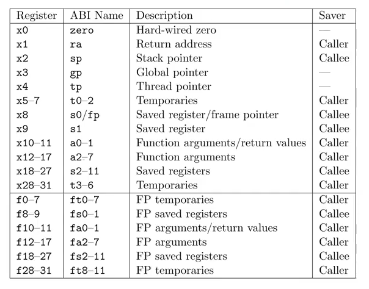

# 学习笔记
## 问题
1. 调用函数时栈是从高地址向低地址增长，但是内核栈的guard page在高地址啊
2. trap用到的寄存器stvec那几个，这个图里怎么没有\
re: stvec是特殊寄存器，这个图里的是通用寄存器
## 参考资料
[RISC-V汇编快速入门](https://lgl88911.gitee.io/2021/02/28/RISC-V%E6%B1%87%E7%BC%96%E5%BF%AB%E9%80%9F%E5%85%A5%E9%97%A8/)
## risc-v
### 寄存器

### 在函数调用时，根据Saver不同寄存器分为Caller和Callee
a调用b
Caller寄存器：不会保留，可以被b可以覆盖
Callee寄存器：会被保留，不可以被b覆盖
### risc-v指令
b一个字节8位
h一个半字16位
w一个字32位
d两个字64位
A&T格式（第一个是目的操作数，后面的是源操作数，除了save指令嗷）
|指令||缩写|
|-|-|-|
|lb rd,offset(rs1)|从地址为寄存器rs1的值加offset的主存中读一个字节，符号扩展后存入rd|load|
|lbu rd,offset(rs1)|从地址为寄存器rs1的值加offset的主存中读一个字节，零扩展后存入rd|load|
|sb rs1,offset(rs2)|把寄存器rs1的值存入地址为寄存器rs2的值加offset的内存中，保留低8位|save|
|sh rs1,offset(rs2)|把寄存器rs1的值存入地址为寄存器rs2的值加offset的内存中，保留低16位|save|
|csrrw rd,csr,rs1|csr中的值写入rd，rs1的值写入csr|control status register|
|csrrs rd,csr,rs1|csr中的值写入rd，rs1的值或上csr的值在写入csr|control status register|
|csrrc rd,csr,rs1|csr中的值写入rd，根据rs1的值对csr中的值按位清零再写入csr|control status register|
|csrr rd,csr|相当于csrrs rd,csr,zero|
|csrw csr,rs1|相当于csrrw zero,csr,rs1|

## 三种trap
也就是三种事件，会使cpu把正在执行的普通代码强制转换成一段特殊代码，去处理这个事件
1. system call 
2. exception (e.g. devide by 0 and use a invalid virtual address) 
3. interrupt (the disk hardware finishes a read or write request)

## risc-v的trap机制
### 几个重要的寄存器
* **stvec**：保存处理trap的handler的地址
* **sepc**：陷阱发生时，保存pc的值。可以通过sret指令将sepc寄存器的值复制到pc寄存器中，userret中，sret指令将sepc的值复制到pc
* **scause**：描述trap的类型
* **sscratch**：一个特别的寄存器，通常发生在trap中，并进入到uservec之后，sscratch装载着指向进程trapframe的指针（该进程的trapframe，在进程被创建，并从userret返回的时候，就已经被内核设置好并且放置到sscratch中）。
* **sstatus**：sstatus的SIE位控制是否启用设备中断，SPP位指示trap是来自用户模式还是监管模式，并控制sret返回什么模式
### trap发生时，risc-v的硬件处理步骤（除了timer interrupts）
1. 如果是device interrupt，sstatus的SIE会被清除，然后就没了，不会执行下面的步骤
2. 清除sstatus的SIE使interrupt不可用
3. 把pc的值存到sepc
4. 将现在的mode保存到sstatus的SPP
5. 设置scause（描述trap的类型）
6. set the mode to supervisor
7. copy stvec(address of handler) to the pc
8. 根据pc的值继续运行\
**其他寄存器都不会变化，页表、栈（sp）都不会变化，这些都是软件的工作**
## 用户空间的traps
用户页表需要保存uservec的映射，uservec是trap代码路径的第一步
下面的这些代码就是为了进入内核做准备的
```python
struct trapframe {
  /*   0 */ uint64 kernel_satp;   // kernel page table
  /*   8 */ uint64 kernel_sp;     // top of process's kernel stack
  /*  16 */ uint64 kernel_trap;   // usertrap()
  /*  24 */ uint64 epc;           // saved user program counter
  /*  32 */ uint64 kernel_hartid; // saved kernel tp
  /*  40 */ uint64 ra;
  /*  48 */ uint64 sp;
  /*  56 */ uint64 gp;
  /*  64 */ uint64 tp;
  /*  72 */ uint64 t0;
  /*  80 */ uint64 t1;
  /*  88 */ uint64 t2;
  /*  96 */ uint64 s0;
  /* 104 */ uint64 s1;
  /* 112 */ uint64 a0;
  /* 120 */ uint64 a1;
  /* 128 */ uint64 a2;
  /* 136 */ uint64 a3;
  /* 144 */ uint64 a4;
  /* 152 */ uint64 a5;
  /* 160 */ uint64 a6;
  /* 168 */ uint64 a7;
  /* 176 */ uint64 s2;
  /* 184 */ uint64 s3;
  /* 192 */ uint64 s4;
  /* 200 */ uint64 s5;
  /* 208 */ uint64 s6;
  /* 216 */ uint64 s7;
  /* 224 */ uint64 s8;
  /* 232 */ uint64 s9;
  /* 240 */ uint64 s10;
  /* 248 */ uint64 s11;
  /* 256 */ uint64 t3;
  /* 264 */ uint64 t4;
  /* 272 */ uint64 t5;
  /* 280 */ uint64 t6;
};
uservec:    
	#
        # trap.c sets stvec to point here, so
        # traps from user space start here,
        # in supervisor mode, but with a
        # user page table.
        #
        # sscratch points to where the process's p->trapframe is
        # mapped into user space, at TRAPFRAME.
        #
    # 把现在寄存器的值保存在触发这个陷阱的进程的TRAPFRAME页
	# swap a0 and sscratch
        # so that a0 is TRAPFRAME
        csrrw a0, sscratch, a0

        # save the user registers in TRAPFRAME
        sd ra, 40(a0)
        sd sp, 48(a0)
        sd gp, 56(a0)
        sd tp, 64(a0)
        sd t0, 72(a0)
        sd t1, 80(a0)
        sd t2, 88(a0)
        sd s0, 96(a0)
        sd s1, 104(a0)
        sd a1, 120(a0)
        sd a2, 128(a0)
        sd a3, 136(a0)
        sd a4, 144(a0)
        sd a5, 152(a0)
        sd a6, 160(a0)
        sd a7, 168(a0)
        sd s2, 176(a0)
        sd s3, 184(a0)
        sd s4, 192(a0)
        sd s5, 200(a0)
        sd s6, 208(a0)
        sd s7, 216(a0)
        sd s8, 224(a0)
        sd s9, 232(a0)
        sd s10, 240(a0)
        sd s11, 248(a0)
        sd t3, 256(a0)
        sd t4, 264(a0)
        sd t5, 272(a0)
        sd t6, 280(a0)

	# save the user a0 in p->trapframe->a0
        #sscratch是原来的a0，先放到t0，再放到TRAPFRAME偏移为112的位置
        csrr t0, sscratch
        sd t0, 112(a0)

        # restore kernel stack pointer from p->trapframe->kernel_sp
        ld sp, 8(a0)

        # make tp hold the current hartid, from p->trapframe->kernel_hartid
        ld tp, 32(a0)

        # load the address of usertrap(), p->trapframe->kernel_trap
        ld t0, 16(a0)
        # 这里把页表设置成了内核页表
        # restore kernel page table from p->trapframe->kernel_satp
        ld t1, 0(a0)
        csrw satp, t1
        sfence.vma zero, zero

        # a0 is no longer valid, since the kernel page
        # table does not specially map p->tf.

        # jump to usertrap(), which does not return
        jr t0
```
上面代码最后 jump to usertrap，usertrap检验是哪一种trap执行对应的操作
```c
void
usertrap(void)
{
  int which_dev = 0;

  if((r_sstatus() & SSTATUS_SPP) != 0)
    panic("usertrap: not from user mode");

  // send interrupts and exceptions to kerneltrap(),
  // since we're now in the kernel.
  // 切换成内核页表就要改变stvec，因为内核运行的时候也可能产生trap
  w_stvec((uint64)kernelvec);

  struct proc *p = myproc();
  
  // save user program counter.
  p->trapframe->epc = r_sepc();
  
  if(r_scause() == 8){
    // system call

    if(p->killed)
      exit(-1);

    // sepc points to the ecall instruction,
    // but we want to return to the next instruction.
    p->trapframe->epc += 4;

    // an interrupt will change sstatus &c registers,
    // so don't enable until done with those registers.
    intr_on();

    syscall();
  } else if((which_dev = devintr()) != 0){
    // ok
  } else {
    printf("usertrap(): unexpected scause %p pid=%d\n", r_scause(), p->pid);
    printf("            sepc=%p stval=%p\n", r_sepc(), r_stval());
    p->killed = 1;
  }

  if(p->killed)
    exit(-1);

  // give up the CPU if this is a timer interrupt.
  if(which_dev == 2)
    yield();

  usertrapret();
}
```
返回用户空间的第一步是调用usertrapret函数
```c
//
// return to user space
//
void
usertrapret(void)
{
  struct proc *p = myproc();

  // we're about to switch the destination of traps from
  // kerneltrap() to usertrap(), so turn off interrupts until
  // we're back in user space, where usertrap() is correct.
  intr_off();

  // send syscalls, interrupts, and exceptions to trampoline.S
  w_stvec(TRAMPOLINE + (uservec - trampoline));

  // set up trapframe values that uservec will need when
  // the process next re-enters the kernel.
  p->trapframe->kernel_satp = r_satp();         // kernel page table
  p->trapframe->kernel_sp = p->kstack + PGSIZE; // process's kernel stack
  p->trapframe->kernel_trap = (uint64)usertrap;
  p->trapframe->kernel_hartid = r_tp();         // hartid for cpuid()

  // set up the registers that trampoline.S's sret will use
  // to get to user space.
  
  // set S Previous Privilege mode to User.
  unsigned long x = r_sstatus();
  x &= ~SSTATUS_SPP; // clear SPP to 0 for user mode
  x |= SSTATUS_SPIE; // enable interrupts in user mode
  w_sstatus(x);

  // set S Exception Program Counter to the saved user pc.
  w_sepc(p->trapframe->epc);

  // tell trampoline.S the user page table to switch to.
  uint64 satp = MAKE_SATP(p->pagetable);

  // jump to trampoline.S at the top of memory, which 
  // switches to the user page table, restores user registers,
  // and switches to user mode with sret.
  uint64 fn = TRAMPOLINE + (userret - trampoline);
  ((void (*)(uint64,uint64))fn)(TRAPFRAME, satp);
}
```
fn函数就是调用userret
```python
userret:
        # userret(TRAPFRAME, pagetable)
        # switch from kernel to user.
        # usertrapret() calls here.
        # a0: TRAPFRAME, in user page table.
        # a1: user page table, for satp.

        # switch to the user page table.
        csrw satp, a1
        sfence.vma zero, zero

        # put the saved user a0 in sscratch, so we
        # can swap it with our a0 (TRAPFRAME) in the last step.
        ld t0, 112(a0)
        csrw sscratch, t0

        # restore all but a0 from TRAPFRAME
        ld ra, 40(a0)
        ld sp, 48(a0)
        ld gp, 56(a0)
        ld tp, 64(a0)
        ld t0, 72(a0)
        ld t1, 80(a0)
        ld t2, 88(a0)
        ld s0, 96(a0)
        ld s1, 104(a0)
        ld a1, 120(a0)
        ld a2, 128(a0)
        ld a3, 136(a0)
        ld a4, 144(a0)
        ld a5, 152(a0)
        ld a6, 160(a0)
        ld a7, 168(a0)
        ld s2, 176(a0)
        ld s3, 184(a0)
        ld s4, 192(a0)
        ld s5, 200(a0)
        ld s6, 208(a0)
        ld s7, 216(a0)
        ld s8, 224(a0)
        ld s9, 232(a0)
        ld s10, 240(a0)
        ld s11, 248(a0)
        ld t3, 256(a0)
        ld t4, 264(a0)
        ld t5, 272(a0)
        ld t6, 280(a0)

	# restore user a0, and save TRAPFRAME in sscratch
        csrrw a0, sscratch, a0
        
        # return to user mode and user pc. 
        # usertrapret() set up sstatus and sepc.
        sret
        # sret做三件事 ①复制sepc到pc ②切换到用户模式 ③开放中断
```
## 内核空间的traps
第一步：kernelvec
由于此时已经是内核空间下，trap发生时，就不需要修改satp和sp了，内核页表和内核栈都可以继续使用。\
首先把寄存器的值保存到内核栈中。
```python
kernelvec:
        // make room to save registers.
        // kernelvec saves the registers on the stack of the interrupted kernel thread, 
        // which makes sense because the register values belong to that thread
        addi sp, sp, -256

        // save the registers.
        sd ra, 0(sp)
        sd sp, 8(sp)
        sd gp, 16(sp)
        sd tp, 24(sp)
        sd t0, 32(sp)
        sd t1, 40(sp)
        sd t2, 48(sp)
        sd s0, 56(sp)
        sd s1, 64(sp)
        sd a0, 72(sp)
        sd a1, 80(sp)
        sd a2, 88(sp)
        sd a3, 96(sp)
        sd a4, 104(sp)
        sd a5, 112(sp)
        sd a6, 120(sp)
        sd a7, 128(sp)
        sd s2, 136(sp)
        sd s3, 144(sp)
        sd s4, 152(sp)
        sd s5, 160(sp)
        sd s6, 168(sp)
        sd s7, 176(sp)
        sd s8, 184(sp)
        sd s9, 192(sp)
        sd s10, 200(sp)
        sd s11, 208(sp)
        sd t3, 216(sp)
        sd t4, 224(sp)
        sd t5, 232(sp)
        sd t6, 240(sp)
        // call the C trap handler in trap.c
        call kerneltrap
```
第二步，判断trap类型
```c
// interrupts and exceptions from kernel code go here via kernelvec,
// on whatever the current kernel stack is.
void
kerneltrap()
{
  int which_dev = 0;
  // 在开始将sepc,sstatus先存起来
  // Because a yield may have disturbed the saved sepc and the saved previous mode in sstatus
  uint64 sepc = r_sepc();
  uint64 sstatus = r_sstatus();
  uint64 scause = r_scause();
  
  if((sstatus & SSTATUS_SPP) == 0)
    panic("kerneltrap: not from supervisor mode");
  if(intr_get() != 0)
    panic("kerneltrap: interrupts enabled");

  // 异常
  if((which_dev = devintr()) == 0){
    printf("scause %p\n", scause);
    printf("sepc=%p stval=%p\n", r_sepc(), r_stval());
    panic("kerneltrap");
  }
  // 时间片完，放弃cpu
  // give up the CPU if this is a timer interrupt.
  // process’s kernel thread is running(rather than a scheduler thread)
  if(which_dev == 2 && myproc() != 0 && myproc()->state == RUNNING)
    yield();

  // the yield() may have caused some traps to occur,
  // so restore trap registers for use by kernelvec.S's sepc instruction.
  w_sepc(sepc);
  w_sstatus(sstatus);
}
```
第三步：恢复所有的寄存器
```c
        // restore registers.
        ld ra, 0(sp)
        ld sp, 8(sp)
        ld gp, 16(sp)
        // not this, in case we moved CPUs: ld tp, 24(sp)
        ld t0, 32(sp)
        ld t1, 40(sp)
        ld t2, 48(sp)
        ld s0, 56(sp)
        ld s1, 64(sp)
        ld a0, 72(sp)
        ld a1, 80(sp)
        ld a2, 88(sp)
        ld a3, 96(sp)
        ld a4, 104(sp)
        ld a5, 112(sp)
        ld a6, 120(sp)
        ld a7, 128(sp)
        ld s2, 136(sp)
        ld s3, 144(sp) 
        ld s4, 152(sp)
        ld s5, 160(sp)
        ld s6, 168(sp)
        ld s7, 176(sp)
        ld s8, 184(sp)
        ld s9, 192(sp)
        ld s10, 200(sp)
        ld s11, 208(sp)
        ld t3, 216(sp)
        ld t4, 224(sp)
        ld t5, 232(sp)
        ld t6, 240(sp)

        addi sp, sp, 256
        // return to whatever we were doing in the kernel.
        // sret将sepc复制到pc中，根据sstatus寄存器的设置，切换到监管者模式，并重新开放中断。
        // resumes the interrupted kernel code
        sret
```
## page-fault exceptions三个实例
### fork的copy on write机制
把所有的物理页标记成只读，父子进程其中一个尝试对物理内存进行时，发生缺页异常，给这一页分配新的物理帧，并把父子进程的这两页开放权限为读和写，因为fork的子进程一般很快就会调用exec而结束，所以fork效率非常高。
### 懒惰分配 Lazy Allocation
用户进程可以调用sbrk请求更多的物理内存的时候，内核只是简单的标记该进程的大小已增长（p->sz），却不给他分配物理内存，在使用到这个内存的时候，会发生缺页异常，再去分配物理帧。
### 请求调页 Demand Paging
当需要装载一些页到物理内存中，但RAM的空闲空间不足时，内核此时可以**逐出**一些物理页，将这些页写到诸如磁盘等地方，同时在相应页表中标记PTE为无效。之后，当别的进程读写这些被逐出的页时，就会产生**缺页错误**。内核发现这些页已经被换出到磁盘上，因此首先在RAM中为它们找到空间，然后从磁盘上**重新读进这些页**，改写PTE为有效，更新页表，并且重新执行读写指令。内核在RAM为这些物理页找空间的时候，可能又要逐出别的页。\
这种模式，在满足访存局部性的情况下表现很好，进程在一个时间段内只访问固定一部分物理页，这避免了频繁地换入换出页。\
还有其它一些功能特性也利用了分页和缺页错误来实现，例如自动增长的栈Automatically extending stacks和内存映射文件Memory-mapped files等。
## real world
如果我们直接将内核的映射也加入用户页表中，甚至可以彻底解决切换页表这样的棘手问题，尤其是我们反复穿梭于内核和用户空间之间，只需要适当地设置相关PTE中的标志位，保证我们建立起来的隔离机制不被破坏。系统调用也能从中受益，例如内核可以直接使用用户指针。\
事实上，很多操作系统就是这么设计的，在效率上的提升很显著。
# 实验笔记
## 参考资料
[安装gdb](https://zhuanlan.zhihu.com/p/331492444)
## Backtrace
这个很简单，毕竟我可是做过bomb lab的男人
## Alarm
proc新定义的内容
```cpp
  int interval; //the length of period
  uint64 handler; //the handler of alarm
  int action; //the starting position of now-period
  uint64 alarming;//whether it is alarming
 struct trapframe pret;//saved registers
```
每次时钟中断的时候，就判断是不是满足时间要求。\
满足的话，就把现在myproc()->epc赋值为handler，这个中断结束之后，pc的值就成了这个handler的地址。\
handler结束执行sigreturn恢复原来的寄存器环境。