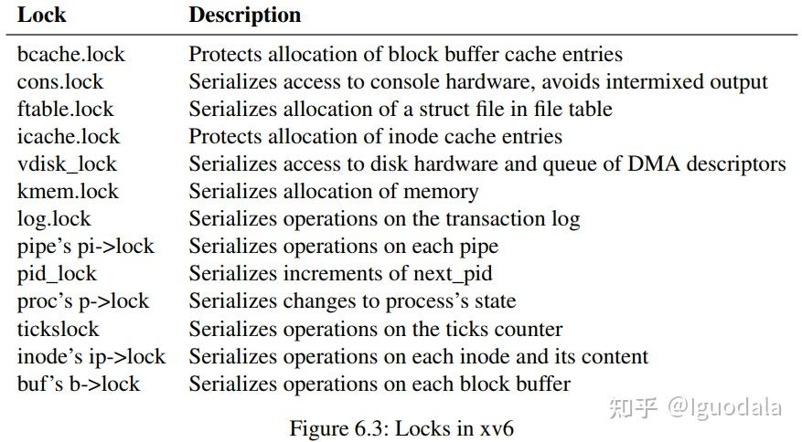

[参考中山爷的帖子](https://zhuanlan.zhihu.com/p/352699414)
#### 同步工具Synchronization Tools/并发控制Concurrency Control
常用的同步工具有：锁Lock，条件变量Conditional Variable，信号量Semaphore等。

#### 临界区和竞争条件
访问共享资源的代码段，我们称之为**临界区Critical Section**，而多个执行线程同时进入临界区并尝试更新共享数据结构的情况，我们称之为**竞争条件Race Condition**。

下面是一个生产者-消费者的模型
```c
// Producer
while (true) {
  /* produce an item in next produced */
  while (count == BUFFER SIZE)
    ; /* do nothing */
  buffer[in] = next produced;
  in = (in + 1) % BUFFER SIZE;
  count++;
}

// Consumer
while (true) {
  while (count == 0)
    ; /* do nothing */
  next consumed = buffer[out];
  out = (out + 1) % BUFFER SIZE;
  count--;
  /* consume the item in next consumed */
}
```
count--和count++编译后的机器指令可能像下面这样
```c
//count++
reg1 = count;
reg1 = reg1 + 1;
count = reg1;
//count--
reg2 = count;
reg2 = reg2 - 1; 
count = reg2;
//假设两个进程在不同的cpu上运行，count初始值是5，同时执行count++和count--可能会出现下面这种情况

reg1 = count;//reg1=5
reg1 = reg1 + 1;//reg1=6
reg2 = count;//reg2=5
count = reg1;//count=6
reg2 = reg2 - 1;//reg2=4
count = reg2;//count=4
//最终count为4
```
并发的修改共享数据结构的代码，我们就称为临界区（盗个图）

## 互斥锁Mutex Lock
要解决临界区问题，其中一种方法就是使用同步工具里的**互斥锁**，简称锁。
### 基本要求
- **互斥**，这是最基本的要求，一次只有一个进程进入临界区。
- **进步**，多个进程同时要求进入临界区时，有某种方式决定谁先进入，**这种决定不能被无限推迟（死锁或活锁）**
- **有限等待**，不能有进程处于饥饿状态（starvation），一直不能获得锁。
### 死锁
#### 死锁四条件
- **互斥**，资源不能被共享，必须独占。
- **持有并等待**，程持有至少一个资源，并等待获取其他资源。
- **不可抢占**，已被分配的资源不能被强行夺走，只能由持有它的线程主动释放。
- **循环等待**，存在一个线程等待链，链中每个线程都在等待下一个线程持有的资源。
#### 例子
假设线程 A 持有资源 1，线程 B 持有资源 2。线程 A 需要资源 2 才能继续执行，而线程 B 需要资源 1 才能继续执行。这时，A 和 B 都在等待对方释放资源，导致系统进入死锁状态。
### 活锁
活锁是指多个线程或进程频繁改变状态或操作，但彼此无法取得进展的情况。与死锁不同的是，线程在活锁中并未阻塞，但它们却陷入了无休止的状态切换，无法完成预期的工作。
#### 例子
假设有两个线程 A 和 B，它们在检测到对方正在使用某个资源时，会让出资源并尝试重新获取。如果它们同时让出资源，又同时重新尝试获取资源，就可能导致一个循环：两个线程不断地放弃和尝试获取资源，系统因此无法继续向前推进。
### 实现
由于指令顺序会被打乱等因素，完全使用软件解决临界区问题十分难于实现（例如Peterson's Solution）\
下面介绍几种简单的原子硬件指令可以很容易实现锁
#### Test and Set
逻辑如下，注意这几句是原子性的
```c
int TestAndSet(int *old_ptr, int new){
  int old = *old_ptr;  // 获取旧的值
  *old_ptr = new;      // 存储新的值
  return old;          // 返回旧的值
}
```
比如gcc的内置函数__sync_lock_test_and_set，常用于实现简单、高效的自旋锁。它背后的核心原理就是依赖于test-and-set。\
我们可以用这个指令实现一个很简单的**自旋锁Spinning Lock**。其实就是因为赋值是原子的，不会出现上面count--和count++同时执行顺序的问题。
```c
typedef struct lock_t{
  int flag;
} lock_t;

void init(lock_t *lock){
  lock->flag = 0;  // 0表示锁可用，1表示锁已被占用
}

void lock(lock_t *lock){
  while(TestAndSet(&lock->flag, 1) == 1)  // 第一个执行TestAndSet的线程会得到旧值0而跳出循环
    ;  // 不做任何事情，只是自旋地等待
}

void unlock(lock_t *lock){
  lock->flag = 0;
}

void main()
{
  init(&lock_t);

  do{
    lock(&lock_t);

    // 临界区

    unlock(&lock_t);
  }while(true);

  return;
}
```
上面的代码不满足**有限等待**，可能有的进程一直得不到cpu，可以改成下面这样，嘶，看倒是能看懂，但还真不太好想出来啊。
```c
typedef struct lock_t{
  int flag;
} lock_t;

int waiting[n];  // waiting[i] = 1 时表示i号线程想要进入临界区
 
void init(lock_t *lock){
  lock->flag = 0;  // 0表示锁可用，1表示锁已被占用
  for(int i=0;i<n;i++)
    waiting[i] = 0;
}

void lock(lock_t *lock){
  waiting[i] = 1;  // i是当前线程的编号，表示i号线程想要进入临界区，因此先等待
  int key = 1;
  while(waiting[i] && key)  // 只有当waiting[i] = 0 或 key = 0 时i号线程才能进入临界区
    key = TestAndSet(&lock->flag, 1);  // 第一个执行TestAndSet的线程会使key变为0
  waiting[i] = 0;  // 表示i号线程已经进入临界区，不用再自旋等待
}

void unlock(lock_t *lock){
  j = (i + 1) % n;  // 尝试把机会让给下一个线程
  while((j != i) && !waiting[j])
    j = (j + 1) % n;  // 轮询一圈，按编号顺序搜索，找到需要进入临界区的下一个线程
  if(j == i)
    lock->flag = 0;  // 当前没有其它线程需要进入临界区，直接释放锁
  else
    waiting[j] = 0;  // j号线程想要进入临界区，于是使其不再等待
                     // waiting[j] = 0 表示j号线程可以进入
                     // 而lock->flag = 1 仍成立，表示锁仍被持有，只是从i转移到j
}

void main()
{
  init(&lock_t);

  do{
    lock(&lock_t);

    // 临界区

    unlock(&lock_t);
  }while(true);

  return;
}
```
#### Compare and Swap
逻辑如下
```c
int CompareAndSwap(int *ptr, int expected, int new){
  int actual = *ptr;
  if(actual == expected)
    *ptr = new;
  return actual;
}
```
和test-and-set十分相似，实现自旋锁只需要改动下面一句
```c
void lock(lock_t *lock){
  while(CompareAndSwap(&lock->flag, 0, 1) == 1)
    ;
}
```
#### Fetch and Add
逻辑如下
```c
int FetchAndAdd(int *ptr){
  int old = *ptr;
  *ptr = old + 1;
  return old;
}
```
我们可以用这个实现一个ticket锁，每个进程等待的时候有着自己的ticket，等turn轮到自己的时候就会进入临界区。
```c
typedef struct lock_t{
  int ticket;
  int turn;
} lock_t;

void lock_init(lock_t *lock){
  lock->ticket = 0;
  lock->turn = 0;
}

void lock(lock_t *lock){
  int myturn = FetchAndAdd(&lock->ticket);
  while(lock->turn != myturn)
    ; // 自旋等待
}

void unlock(lock_t *lock){
  FetchAndAdd(&lock->turn);
}

void main()
{
  lock_init(&lock_t);

  do{
    lock(&lock_t);

    // 临界区

    unlock(&lock_t);
  }while(true);

  return;
}
```
#### 链接加载Load-Linked和条件式存储Store-Conditional
逻辑如下
```c
int LoadLinked(int *ptr){
  return *ptr;
}
int StoreConditional(int *ptr, int value){
  if(在上一次加载ptr之后，期间没有对ptr的更新){
    *ptr = value;
    return 1;  // 成功
  }else{
    return 0;  // 失败
  }
}
```
这是MIPS架构的两个指令，不讨论了。
#### 内存屏障Memory Barriers
当执行内存屏障指令时，系统确保，在内存屏障之前所有的load和store，都会在内存屏障之后的load或store执行前完成。
#### 原子变量Atomic Variables
原子变量的更新是原子性的，不会出现count--和count++结果错误的情况。\
但是还可能出现错误，例如在生产者消费者模型中，当前缓冲区为空，因此有两个消费者进程会不断循环，等待count>0。如果现在有生产者往缓冲区中写入一项内容，那么count=1，因此两个消费者进程都有机会跳出while循环，并同时进入临界区中，但我们的缓冲区中只有1项内容可读，因此错误就会发生。
## 自旋锁Spinning Lock
前面使用了硬件指令搭建了简单的互斥锁，它实际上是自旋锁，我们对自旋锁给出更一般化的形式定义。\
一般提供两个接口。acquire用于获取锁，release用于释放锁。
```c
acquire(){
  while(!available)
    ;  // busy wait (i.e. spinning)
  available = false;
}

release(){
  available = true;
}
```
下面是xv6自旋锁的实现，主要使用了test-and-set和内存屏障。
```c
// Mutual exclusion lock.
struct spinlock {
  uint locked;       // Is the lock held?

  // For debugging:
  char *name;        // Name of lock.
  struct cpu *cpu;   // The cpu holding the lock.
};

// Acquire the lock.
// Loops (spins) until the lock is acquired.
void
acquire(struct spinlock *lk)
{
  push_off(); // disable interrupts to avoid deadlock.
  if(holding(lk))
    panic("acquire");

  // On RISC-V, sync_lock_test_and_set turns into an atomic swap:
  //   a5 = 1
  //   s1 = &lk->locked
  //   amoswap.w.aq a5, a5, (s1)
  while(__sync_lock_test_and_set(&lk->locked, 1) != 0)
    ;

  // 即 memory barrior
  // it tells the compiler and CPU to not reorder loads or stores across the barrier
  __sync_synchronize();

  // Record info about lock acquisition for holding() and debugging.
  lk->cpu = mycpu();
}

// Release the lock.
void
release(struct spinlock *lk)
{
  if(!holding(lk))
    panic("release");

  lk->cpu = 0;

  // On RISC-V, this emits a fence instruction.
  __sync_synchronize();

  // Release the lock, equivalent to lk->locked = 0.
  // This code doesn't use a C assignment, since the C standard
  // implies that an assignment might be implemented with
  // multiple store instructions.
  // On RISC-V, sync_lock_release turns into an atomic swap:
  //   s1 = &lk->locked
  //   amoswap.w zero, zero, (s1)
  __sync_lock_release(&lk->locked);

  pop_off();
}
```
自旋锁的主要缺点是，它会忙等，这种忙等会持续消耗CPU资源。\
考虑单CPU的情况，性能开销相当大，假设一个线程持有锁进入临界区，然后因时钟中断被抢占，调度器因此运行其它每一个线程，而其它线程都在竞争该锁，因此每个线程都会在放弃CPU之前，自旋一整个时间片，从而浪费了大量CPU周期。\
不过，在多CPU上，尤其是当线程数大于CPU数时，自旋锁的性能表现不错。假设线程A在CPU1上，线程B在CPU2上，都竞争同一个锁。A占有锁时，B会在CPU2上自旋，而临界区一般很短，所以B很快就获得锁。因此，自旋等待其它CPU上的锁时，不会浪费很多CPU周期。\
线程在等待锁时，没有上下文切换。（对比睡眠锁）
## Locks and Interrup
在xv6中时钟中断处理程序clockintr需要增加ticks值，而一个内核线程也可能通过系统调用sys_sleep来访问ticks值，因此，我们为ticks维护了一把锁tickslock，clockintr和sys_sleep都需要获取该自旋锁来访问或修改ticks值。\
考虑这种情况，一个内核线程调用sys_sleep，因此它持有tickslock。此时运行该内核线程的CPU收到时钟中断，因此被导向到中断处理程序clockintr中，clockintr第一件事就是acquire(&tickslock)，但是因为这把锁已经被内核线程持有，所以clockintr会一直在原地自旋等待tickslock被释放。\
好学的同学会问了，在多cpu的处理器中，这个持有tickslock的进程不会被调度到其他的cpu运行吗？\
其实不会的，内核调度器选择那些状态为RUNNABLE的线程调度执行，而对于被中断的线程，由于yield在clockintr返回之后才被调用，因此该线程的状态还是RUNNING而不是RUNNABLE，自然就被其它的内核调度器无视了。\
我们可以做以下规定避免这种死锁Deadloc。

- 如果中断处理程序需要持有某一把自旋锁，那么每个CPU在持有这把自旋锁时，一定要保持中断关闭。

这样在内核线程持有tickslock的时候，就不会发生时钟中断了。xv6的解决方式更加保守一些：只要CPU试图获取任何自旋锁，那么该CPU总是会关闭中断。
## Sleep Lock
如果临界区很长的话，那么尝试获取该锁的其它线程不必占用大量的CPU周期，而是以一种**睡眠**的方式**主动放弃CPU**，在稍后的某个时间再被重新**唤醒**执行。\
为了解决有限等待，我们可以加入队列保存等待锁的进程。
```c
// 在这里，有两个lock，flag和guard
typedef struct lock_t{
  int flag;
  int guard;
  queue_t *q;
} lock_t;

void lock_init(lock_t *m){
  m->flag = 0;
  m->guard = 0;
  queue_init(m->q);
}

void lock(lock_t *m){
  while(TestAndSet(&m->guard, 1) == 1)
    ;  // 自旋地等待直到获取guard lock
  if(m->flag == 0){
    m->flag = 1;   // flag lock还没有被获取，因此成功获取
    m->guard = 0;  // 释放guard lock
  }else{
    queue_add(m->q, gettid());  // flag lock已经被获取，该线程将进入队列中睡眠
    m->guard = 0;  // 睡眠之前释放guard lock
    park();        // 睡眠
  }
}

void unlock(lock_t *m){
  while(TestAndSet(&m->guard, 1) == 1)
    ;  // 自旋地等待直到获取guard lock
  if(queue_empty(m->q))
    m->flag = 0;  //没有人要获取flag lock，直接释放它
  else
    unpark(queue_remove(m->q));  // 从队列里唤醒一个线程，把flag lock交给它
  m->guard = 0;  // 结束之前释放guard lock
}
```
这种先获得guard，再去请求真的flag的思路，有一种说法是会自动适应不同的锁持有时间。对于每次临界区很短的锁，guard变成0之后，flag变成1，其他申请这个锁的时候可以停顿一下，尽量不进行睡眠操作，因为睡眠操作的代价比较大（涉及上下文切换）。\
这个解决方案有一个潜在的竞争条件，进程T放到队列的之后还没睡眠，这个锁被释放了，会unpark T，大家都以为这个锁被T占有，但是T立马就park了。\
### xv6实现睡眠锁
```c
// Long-term locks for processes
struct sleeplock {
  uint locked;       // Is the lock held?
  struct spinlock lk; // spinlock protecting this sleep lock
  
  // For debugging:
  char *name;        // Name of lock.
  int pid;           // Process holding lock
};

void
acquiresleep(struct sleeplock *lk)
{
  // 第一个进程先抓取小锁,将小锁的locked置1
  // 这时大锁还未被上锁(lk->locked=0),跳过while继续执行
  // 将大锁也抓取,将大锁的locked置1
  // 最后释放小锁,这时大锁在第一个进程手中
  // 后续的进程进来之后可以抓到小锁
  // 但是因为大锁被抓,lk->locked=1,则进到while中
  // 调用sleep(),释放小锁并且挂起进程在大锁上
  // 只有调用releasesleep(),才会释放大锁,同时唤醒挂起在大锁上的进程
  acquire(&lk->lk);
  while (lk->locked) {
    sleep(lk, &lk->lk);
  }
  lk->locked = 1;
  lk->pid = myproc()->pid;
  release(&lk->lk);
}

void
releasesleep(struct sleeplock *lk)
{
  // 要释放大锁的进程先获取小锁
  // 将lk->lk->locked置0,同时调用wakeup()唤醒一个挂起在大锁上的进程
  // 选中一个进程改变其状态为RUNNABLE之后,回来释放小锁
  // 被唤醒的进程会从sleep()中sched()后的对应位置继续,获取小锁
  // 然后,从上次acquiresleep()的while中继续,此时lk->locked=0,跳出while
  // 然后将lk->locked置1,最后释放小锁,这样上次挂起的进程就抓到了大锁
  // 这里注意,在sleep()中需要使用acquire()去抓取小锁
  // 因为要保证该进程总能抓到这把锁,即使该进程要空转,这是为了防止死锁
  // 这样唤醒进程发现小锁被抓走时,会在该处自旋,等到小锁被重新放出为止
  acquire(&lk->lk);
  lk->locked = 0;
  lk->pid = 0;
  wakeup(lk);
  release(&lk->lk);
}
```
中断处理程序不能使用睡眠锁，因为**在睡眠锁保护的临界区内，中断并不关闭。**
## 搬运
### Contention on the Locks
到此为止，我们已经介绍完了互斥锁，你应该对它有了更直观的感受。利用互斥锁，我们确实解决了大部分的并发问题，现在我们的临界区总是能正确运行；但是使用锁确实会使并发问题变得串行化，一次只能有一个进程在临界区中运行，从而影响性能。有趣的是，我们因为使用了多CPU和多线程而产生并发问题，而为了解决并发问题，我们使用了锁，这又使得多CPU的性能优势衰减，经常出现多个进程争夺锁的情况，我们称这种现象为锁的争夺Contention。\
内核设计中，一个重要的部分就是如何避免锁的争夺。xv6对此只做了很简单的工作，复杂的内核会更细致地组织它们的数据结构和相应算法，从而尽最大可能避免锁的争夺。\
怎么减少锁的争夺？我们以xv6为例子，xv6的所有的锁如下图所示。\
\
你可以看到，内核分配器的free-list只用了一把锁保护，因此多个CPU想要分配和释放物理页时，都需要在争夺同一把锁。一个可能的解决方案是，我们为每个CPU都维护一个free-list，因此锁的数量从原来的一把，增加到和CPU的数量相等，这样CPU大部分时间下都不用和其它CPU去争夺锁，而只需要持有自己的锁，并访问自己的free-list。只有在自己的free-list用完了之后，才去和其它CPU争夺别人的锁，然后“偷”一些物理页到自己的free-list上。可以验证，这种方式大量减少了锁的争夺。同样地，对于只有一把锁的缓冲区buffer cache，我们也可以用类似的思路，将缓冲区的空间分配到多个哈希桶中，因此每个哈希桶一把锁，并根据块号来索引哈希桶，从而减少了在缓冲区上的锁的争夺。\
事实上，xv6的课后实验就让我们去改进这些情况，以减少各种锁的争夺。\
因此这指示我们在实际设计并发代码时，我们可以先采用粗粒度Coarse-grained的上锁方式，对要保护的临界区上一把大锁。例如前面提到的内核分配器就是一个很好的例子。然后我们在保证并发正确性的情况下，逐步地拆解这些数据结构，并且使用细粒度Fine-grained的上锁方式。例如xv6对于每个文件都单独维护一把锁，因此修改不同文件的不同进程，不需要在锁的争夺上烦恼。甚至，如果你想再细致一点，你还可以让多个进程同时修改文件，因此使用更细粒度的锁。总之，采用何种粒度的上锁方式，取决于你对性能和代码的复杂性的要求。
### Deadlock and Lock Ordering
在前面的讨论中，我们发现某些情况下会出现死锁。进程申请资源时，如果没有可用资源，那么该进程会进入等待状态，但如果所申请的资源被其它的等待进程占有，那么该进程有可能再也无法改变状态。有关于死锁的更详细的讨论，我们将在下一章中展开。\
我们前面已经提到了两种可能引起死锁的情况：

- 中断处理程序尝试获取线程已经持有的自旋锁。
- 持有自旋锁的进程主动放弃CPU。

现在我们再补充一种，这种死锁的出现和上锁的顺序Lock Ordering有关。\
一个最简单的例子，进程1获取锁的顺序是先A后B，进程2则是先B后A。如果进程1获得A的同时，进程2也获得了B，那么死锁就发生了。\
事实上，这在内核中很常见，因为修改某些数据结构可能会要求你同时持有多个锁，因此上锁的顺序很重要，稍有不慎就会导致死锁。避免这种死锁的解决方案看上去也很简单，只需要规定一个全局的上锁顺序即可。规定全局的上锁顺序，意味着锁实际上是每个函数规范的一部分：调用者必须以一种规定的顺序调用函数，以遵循获取锁的顺序。\
xv6里面有很多这种上锁顺序的实例，尤其是同时持有两个锁的上锁顺序，几乎处处可见。其中，xv6的文件系统代码包含最长的上锁序列。例如，在创建一个文件时，我们需要同时获取以下的锁才能继续执行：文件所在目录的锁，新文件的inode的锁，磁盘缓冲块的锁，磁盘驱动器的锁，以及调用进程的锁。按以上的顺序获取这些锁，死锁才不会发生。\
遵循一个全局的上锁顺序是十分困难的。例如，在一段代码的逻辑可能是先调用M1然后调用M2，但是上锁顺序要求，先取得M2中的锁，再取得M1中的锁。这种事常发生的原因是，上锁顺序并不总是能事先知道的，可能需要持有一把锁之后，才能发现下一把要获取的锁是哪个。例如，文件系统连续地查找路径名中的目录或文件时，获取前一级结点才能查询下一级；或者在wait和exit中，获取父进程的锁，才能在进程表中查找它的子进程。
### Real World
尽管对并发问题和相关原语已经进行了多年的研究，使用互斥锁进行编程仍然十分具有挑战性。通常最好将锁隐藏在更高级的结构中，比如同步队列，xv6并没有这么做。如果你使用锁进行编程，最好使用一些能够识别竞争条件的工具，以帮助你构建正确的并发程序。\
现在大多数操作系统都支持POSIX threads（Pthreads），用户可以利用它，实现多个线程在多个CPU上并发运行。Pthreads支持用户级别的锁，内存屏障等功能。Pthreads也需要操作系统支持一些工作，来保证其正常运作。例如，如果一个pthread阻塞在系统调用上，同一进程中的另一个pthread应该可以抢占在该CPU上执行；又或者，如果一个pthread改变了进程的地址空间，对于运行同一进程的其它pthreads的其它CPU，内核应该更新这些CPU的页表硬件，以反映进程地址空间的变化。\
不使用前面所介绍的原子硬件指令来构建互斥锁也是行得通的，不过开销很大，因此大多数操作系统还是会使用原子硬件指令作为构件。\
多个CPU对于锁的争夺是一件很可怕的事，特别是如果把CPU的缓存也考虑进去的时候。如果一个CPU持有一把锁，并且缓存在它的局部缓存中，那么当另一个CPU需要抢占这把锁的时候，需要用原子指令，更新持有该锁的CPU的局部缓存，并将对应这把锁的缓存行Cache Line（Cache Line可以简单的理解为CPU Cache中的最小缓存单位）移动到另一个CPU的局部缓存中，从而使原CPU中的很多缓存行可能都失效。因此，这告诉我们，从另一个CPU的局部缓存中，获取一行Cache Line，可能比从本地缓存中获取一行Cache Line代价要昂贵得多。\
为了避免使用锁而带来的种种问题和大量开销，很多操作系统也提供了无锁Lock-Free的数据结构和算法。例如，对于不加锁的普通链表，我们自然不能保证并发访问操作该链表的原子性，然而，现在提供了往链表中插入一项的原子性指令。无锁编程是更为复杂和困难的，例如，必须担心指令和内存的重新排序问题。