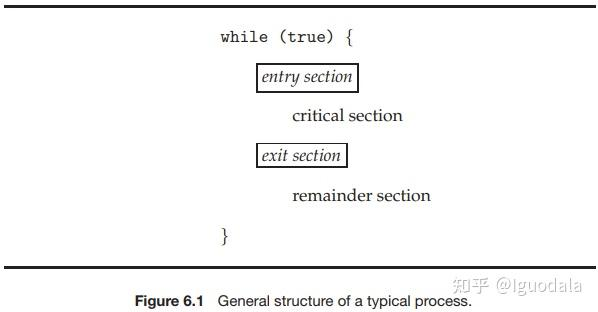

[toc]
[参考中山爷的帖子](https://zhuanlan.zhihu.com/p/352699414)
#### 同步工具Synchronization Tools/并发控制Concurrency Control
常用的同步工具有：锁Lock，条件变量Conditional Variable，信号量Semaphore等。

#### 临界区和竞争条件
访问共享资源的代码段，我们称之为**临界区Critical Section**，而多个执行线程同时进入临界区并尝试更新共享数据结构的情况，我们称之为**竞争条件Race Condition**。

下面是一个生产者消费者的模型
```c
// Producer
while (true) {
  /* produce an item in next produced */
  while (count == BUFFER SIZE)
    ; /* do nothing */
  buffer[in] = next produced;
  in = (in + 1) % BUFFER SIZE;
  count++;
}

// Consumer
while (true) {
  while (count == 0)
    ; /* do nothing */
  next consumed = buffer[out];
  out = (out + 1) % BUFFER SIZE;
  count--;
  /* consume the item in next consumed */
}
```
count--和count++编译后的机器指令可能像下面这样
```c
//count++
reg1 = count;
reg1 = reg1 + 1;
count = reg1;
//count--
reg2 = count;
reg2 = reg2 - 1; 
count = reg2;
//假设两个进程在不同的cpu上运行，count初始值是5，同时执行count++和count--可能会出现下面这种情况

reg1 = count;//reg1=5
reg1 = reg1 + 1;//reg1=6
reg2 = count;//reg2=5
count = reg1;//count=6
reg2 = reg2 - 1;//reg2=4
count = reg2;//count=4
//最终count为4
```
并发的修改共享数据结构的代码，我们就称为临界区（盗个图）

## 互斥锁Mutex Lock
要解决临界区问题，其中一种方法就是使用同步工具里的**互斥锁**，简称锁。
### 基本要求
- **互斥**，这是最基本的要求，一次只有一个进程进入临界区。
- **进步**，多个进程同时要求进入临界区时，有某种方式决定谁先进入，**这种决定不能被无限推迟（死锁或活锁）**
- **有限等待**，不能有进程处于饥饿状态（starvation），一直不能获得锁。
### 死锁
#### 死锁四条件
- **互斥**，资源不能被共享，必须独占。
- **持有并等待**，程持有至少一个资源，并等待获取其他资源。
- **不可抢占**，已被分配的资源不能被强行夺走，只能由持有它的线程主动释放。
- **循环等待**，存在一个线程等待链，链中每个线程都在等待下一个线程持有的资源。
#### 例子
假设线程 A 持有资源 1，线程 B 持有资源 2。线程 A 需要资源 2 才能继续执行，而线程 B 需要资源 1 才能继续执行。这时，A 和 B 都在等待对方释放资源，导致系统进入死锁状态。
### 活锁
活锁是指多个线程或进程频繁改变状态或操作，但彼此无法取得进展的情况。与死锁不同的是，线程在活锁中并未阻塞，但它们却陷入了无休止的状态切换，无法完成预期的工作。
#### 例子
假设有两个线程 A 和 B，它们在检测到对方正在使用某个资源时，会让出资源并尝试重新获取。如果它们同时让出资源，又同时重新尝试获取资源，就可能导致一个循环：两个线程不断地放弃和尝试获取资源，系统因此无法继续向前推进。
### 实现
由于指令顺序会被打乱等因素，完全使用软件解决临界区问题十分难于实现（例如Peterson's Solution）\
下面介绍几种简单的原子硬件指令可以很容易实现锁
#### Test and Set
逻辑如下，注意这几句是原子性的
```c
int TestAndSet(int *old_ptr, int new){
  int old = *old_ptr;  // 获取旧的值
  *old_ptr = new;      // 存储新的值
  return old;          // 返回旧的值
}
```
比如gcc的内置函数__sync_lock_test_and_set，常用于实现简单、高效的自旋锁。它背后的核心原理就是依赖于test-and-set。\
我们可以用这个指令实现一个很简单的**自旋锁Spinning Lock**。其实就是因为赋值是原子的，不会出现上面count--和count++同时执行顺序的问题。
```c
typedef struct lock_t{
  int flag;
} lock_t;

void init(lock_t *lock){
  lock->flag = 0;  // 0表示锁可用，1表示锁已被占用
}

void lock(lock_t *lock){
  while(TestAndSet(&lock->flag, 1) == 1)  // 第一个执行TestAndSet的线程会得到旧值0而跳出循环
    ;  // 不做任何事情，只是自旋地等待
}

void unlock(lock_t *lock){
  lock->flag = 0;
}

void main()
{
  init(&lock_t);

  do{
    lock(&lock_t);

    // 临界区

    unlock(&lock_t);
  }while(true);

  return;
}
```
上面的代码不满足**有限等待**，可能有的进程一直得不到cpu，可以改成下面这样，嘶，看倒是能看懂，但还真不太好想出来啊。
```c
typedef struct lock_t{
  int flag;
} lock_t;

int waiting[n];  // waiting[i] = 1 时表示i号线程想要进入临界区
 
void init(lock_t *lock){
  lock->flag = 0;  // 0表示锁可用，1表示锁已被占用
  for(int i=0;i<n;i++)
    waiting[i] = 0;
}

void lock(lock_t *lock){
  waiting[i] = 1;  // i是当前线程的编号，表示i号线程想要进入临界区，因此先等待
  int key = 1;
  while(waiting[i] && key)  // 只有当waiting[i] = 0 或 key = 0 时i号线程才能进入临界区
    key = TestAndSet(&lock->flag, 1);  // 第一个执行TestAndSet的线程会使key变为0
  waiting[i] = 0;  // 表示i号线程已经进入临界区，不用再自旋等待
}

void unlock(lock_t *lock){
  j = (i + 1) % n;  // 尝试把机会让给下一个线程
  while((j != i) && !waiting[j])
    j = (j + 1) % n;  // 轮询一圈，按编号顺序搜索，找到需要进入临界区的下一个线程
  if(j == i)
    lock->flag = 0;  // 当前没有其它线程需要进入临界区，直接释放锁
  else
    waiting[j] = 0;  // j号线程想要进入临界区，于是使其不再等待
                     // waiting[j] = 0 表示j号线程可以进入
                     // 而lock->flag = 1 仍成立，表示锁仍被持有，只是从i转移到j
}

void main()
{
  init(&lock_t);

  do{
    lock(&lock_t);

    // 临界区

    unlock(&lock_t);
  }while(true);

  return;
}
```
### Compare and Swap
逻辑如下
```c
int CompareAndSwap(int *ptr, int expected, int new){
  int actual = *ptr;
  if(actual == expected)
    *ptr = new;
  return actual;
}
```
和test-and-set十分相似，实现自旋锁只需要改动下面一句
```c
void lock(lock_t *lock){
  while(CompareAndSwap(&lock->flag, 0, 1) == 1)
    ;
}
```