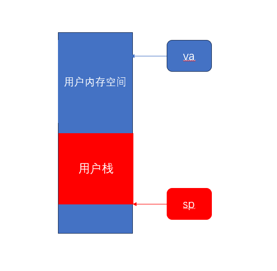

## eliminate allocation from sbrk()
在sys_sbrk()函数中把内存增长的语句注释掉就行，不给新增长的内存分配物理帧了
```c
  /*
  if(growproc(n) < 0)
    return -1;
  */
```
## Lazy allocation（后面两个实验）

在trapuser里面处理page fault。
```c
else if(r_scause() == 0xd || r_scause() == 0xf) {
    uint64 va = r_stval();
    uint64 pa = (uint64)kalloc();
    if (pa == 0) {
      p->killed = 1;
    } else if (va >= p->sz || va <= PGROUNDDOWN(p->trapframe->sp)) {
    // 用户栈是向下增长的，所以sp下面的内存是非法的
      kfree((void*)pa);
      p->killed = 1;
    } else {
      va = PGROUNDDOWN(va);
      memset((void*)pa, 0, PGSIZE);
      if (mappages(p->pagetable, va, PGSIZE, pa, PTE_X | PTE_W | PTE_U | PTE_R) != 0) {
        kfree((void*)pa);
        p->killed = 1;
      }
    }
  }
```
只有遇到page fault才会分配物理帧，这时候还没分配物理帧但合法的va，跟不合法的va是一样的，所以在释放的时候直接continue就行。
```c
void
uvmunmap(pagetable_t pagetable, uint64 va, uint64 npages, int do_free)
{
  uint64 a;
  pte_t *pte;

  if((va % PGSIZE) != 0)
    panic("uvmunmap: not aligned");

  for(a = va; a < va + npages*PGSIZE; a += PGSIZE){
    if((pte = walk(pagetable, a, 0)) == 0)
      //panic("uvmunmap: walk");
      continue;
    if((*pte & PTE_V) == 0)
      continue;
      //panic("uvmunmap: not mapped");
    if(PTE_FLAGS(*pte) == PTE_V)
      panic("uvmunmap: not a leaf");
    if(do_free){
      uint64 pa = PTE2PA(*pte);
      kfree((void*)pa);
    }
    *pte = 0;
  }
}
```
这个fork创建的子进程复制父进程内存不是copy-on-write哎，是一个页面一个页面复制的，但因为lazy allocation，没有分配物理帧的页面就不需要申请一个物理帧对应，跟uvmunmap同理，直接continue就行。
```c
int     
uvmcopy(pagetable_t old, pagetable_t new, uint64 sz)   
{       
  pte_t *pte;    
  uint64 pa, i;  
  uint flags;    
  char *mem;       
  for(i = 0; i < sz; i += PGSIZE){ 
    if((pte = walk(old, i, 0)) == 0) 
      continue;  
      //panic("uvmcopy: pte should exist");   
    if((*pte & PTE_V) == 0)        
      continue;  
      //panic("uvmcopy: page not present");   
    pa = PTE2PA(*pte);    
    flags = PTE_FLAGS(*pte);       
    if((mem = kalloc()) == 0)      
      goto err;  
    memmove(mem, (char*)pa, PGSIZE); 
    if(mappages(new, i, PGSIZE, (uint64)mem, flags) != 0){      
      kfree(mem);
      goto err;  
    }   
  }     
  return 0;      
        
 err:   
  uvmunmap(new, 0, i / PGSIZE, 1); 
  return -1;     
}
```
当一个系统调用使用一个未分配物理帧的虚拟地址时，不会到usertrap处理，我们可以直接在walkaddr中申请一个物理帧
```c
uint64
walkaddr(pagetable_t pagetable, uint64 va)
{
  pte_t *pte;
  uint64 pa;

  if(va >= MAXVA)
    return 0;

  pte = walk(pagetable, va, 0);
  //if(pte == 0)
  //  return 0;
  //if((*pte & PTE_V) == 0)
  //  return 0;
  if (pte == 0 || (*pte & PTE_V) == 0) {
    struct proc *p = myproc();
    if(va >= p->sz || va < PGROUNDUP(p->trapframe->sp)) return 0;
    pa = (uint64)kalloc();
    if (pa == 0) return 0;
    if (mappages(p->pagetable, va, PGSIZE, pa, PTE_W|PTE_R|PTE_U|PTE_X) != 0) {
      kfree((void*)pa);
	  return 0;
    }
	return pa;
  }
  if((*pte & PTE_U) == 0)
    return 0;
  pa = PTE2PA(*pte);
  return pa;
}
```

## 总结
这个实验中间思路一直清晰的，但是trap.c不知道哪里写出了什么问题unmap一直失败，我也没有精力去复现那个错误了，一开始写的代码还是太丑了，毕竟是一点一点往上加，if越来越多，也没发现哪里出了什么问题。对这些函数和内存的布局和结构已经大致清楚了，这才是这个实验的目的。