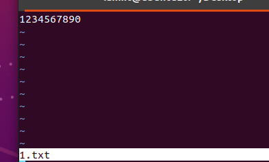
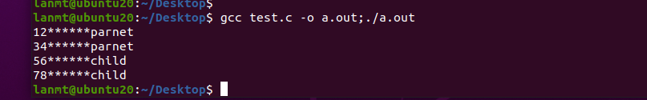
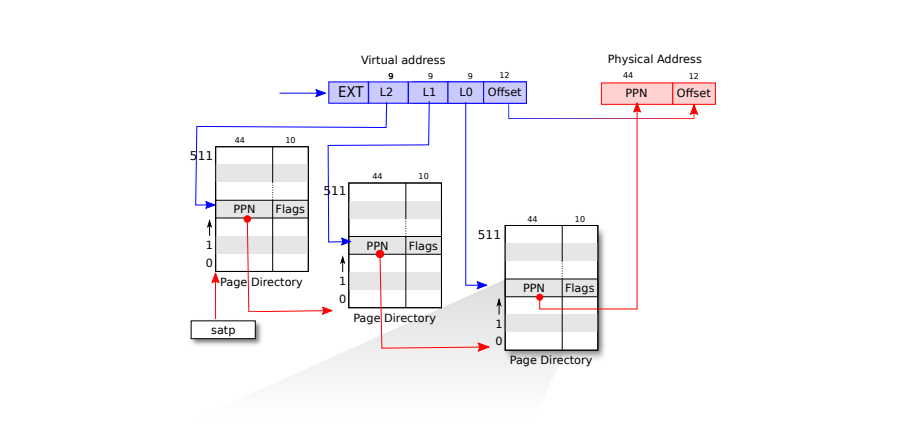
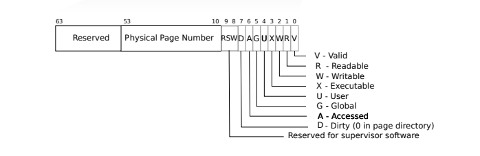
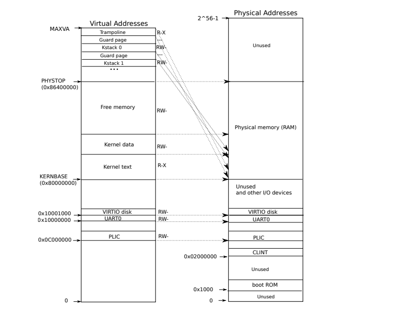
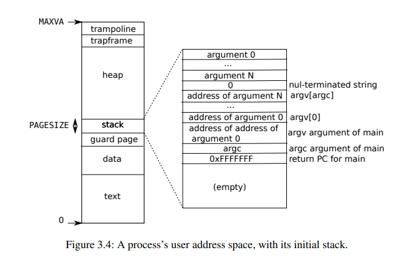

Foreword：
高中的时候真的不会学习，也从来没有感到过学习的乐趣。大学有大部分的时间可以自己安排，自己摸爬滚打了三年，总是有点收获的。首先是自己的状态，生理和心理。其次是“温故而知新”，“温故”真的很重要，另外再加上自己不断的学习，在“温故”的就会遇到很多恍然大悟的瞬间。最后是眼高手低，就像背单词，背写真的很重要，要完全脱离书本，才能知道自己究竟学到了多少。
# 总结
## 前两章记得一些东西
1、fork子进程和父进程直观上完全分离，修改子进程的内容，完全不影响父进程的内容
2、exec会替换调用它的进程的内存，但是会保留它的文件描述符
3、fork复制了文件描述符，但每一个文件当前的偏移仍然是在父子进程之间共享的（这个不用考虑exec，因为exec打开一个进程后不返回，原来的进程不会执行任何操作了）
比如下面这个代码 **↓**
```c
#include<stdio.h>
#include<unistd.h>
#include<sys/types.h>
#include<sys/stat.h>
#include<fcntl.h>
int fd=-1;
int main(){
  if(fd==-1)
    fd = open("1.txt",O_RDONLY);
  
  if(fork()==0)
  {
    char buf[20]="********child";
    read(fd,buf,2);
    printf("%s\n",buf);
    read(fd,buf,2);
    printf("%s\n",buf);
  }
  else{
    char buf[20]="********parnet";
    read(fd,buf,2);
    printf("%s\n",buf);
    read(fd,buf,2);
    printf("%s\n",buf);
  }
	return 0;
}
```

输出结果

4、文件描述符是一个强大的抽象，一个进程向描述符1写出，它有可能是一个文件、一个设备、或是一个管道
5、稍微记一下pipe。 int pipe(int fd[2]);  往fd[1]写入的数据可以从fd[0]读出
6、~~如果 wc 指向了一个管道的写端口，那么 wc 就永远看不到 eof 了。~~
如果wc执行了一个绑定了写端口的管道，那么wc就永远看不到eof了。
7、echo hello world > /tmp/xyz; wc < /tmp/xyz
但管道和临时文件起码有三个关键的不同点。首先，管道会进行自我清扫，如果是 shell 重定向的话，我们必须要在任务完成后删除 /tmp/xyz。第二，管道可以传输任意长度的数据。第三，管道允许同步：两个进程可以使用一对管道来进行二者之间的信息传递，每一个读操作都阻塞调用进程，直到另一个进程用 write 完成数据的发送。
8、父进程中创建的pipe的读写端口和子进程的读写端口是独立的，不想让read一直阻塞，就要把父进程和子进程的读写端口都close了。（同第六条）
9、RISC-V cpu有三个执行指令有三个模式：user mode、supervisor mode、machine mode。xv6是monolithc kernel，操作系统所有的代码都以supervisor mode执行指令，unix 都是这样？ 另外还有microkernel的操作系统，它尽可能让指令以user mode执行指令。supervisor mode执行的指令出问题经常会导致内核崩溃，整个机器就g了。
10、一个进程有一个执行代码用的执行线程，一个进程的内存空间分为两部分，user区和kernel区，kernel区有trampoline和trapframe，trampoline是进出kernel用的，trapframe是保存/恢复进程状态用的。 恢复一个线程时，这个线程的大部分状态都保存在线程的栈上。
11、一个进程有两个栈，user stack 和 kernel stack。执行user指令的时候，只用到user stack，kernel stack是空的。进程用到系统调用或者中断的时候，kernel（内核）的代码，将执行在这个进程的kernel stack上，user stack还是原来的数据，但是用不到了。
12、RIST-V上的进程可以使用ecall指令，提高程序对硬件的权限，进入到kernel定义的入口。使用sret指令在回到用户空间。
13、第一个用户进程怎么运行的：①一个保存在ROM的引导加载程序加载到物理内存。（好像是在哪个文件里，静态的定义在一个数组。）②初始化一个栈，将栈顶放到sp寄存器，跳转到start。③在machine mode 完成一些初始的配置工作。在mstatus寄存器中设置为supervisor mode，然后将main函数的地址写入到mepc寄存器中，通过对satp寄存器清0禁用页表。现在中断和异常都由监管者模式下处理，并设置好计时器，可以产生时钟中断。④通过mret将start函数返回到main函数，现在正式处于监管者模式运行。⑤调用userinit函数创建第一个进程，exec（/init），init随后完成一些设置，包括创建一个控制台、文件描述符012、新建一个子进程运行shell。
14、在用户代码执行exec，请求系统调用函数exec，用户参数放在a0和a1，系统调用号放在a7，然后执行ecall。然后执行syscall函数，通过函数指针执行相应的系统调用。然后就执行系统调用sys_exec，完成一些检查和相关参数复制，就执行kernel/exec.c中的内容。最后系统调用结束会有一个返回值，放在trapframe的a0中。
15、用户传来的虚拟地址（参数），通过一系列函数（在中间有个walkaddr函数检查是否在用户的页表中）转换成内核的虚拟地址，xv6核的虚拟地址和物理地址是直接映射的，就可以去读取用户传来的参数了。（看不懂自己写的东西了，，为什么用户传来的虚拟地址要转换成内核的虚拟地址？？？）
16、TLB和普通的缓存工作的顺序：cpu首先处理的是virtual address，会先转换成物理地址（这里会使用TLB加速），然后有物理内存之后，再去访问普通的缓存，看这个地址是否在cache中，否则会继续向主存访问。
## 对页表的理解




###
页表存在于物理内存中，地址放在satp寄存器里，当需要从一个虚拟地址转换乘物理地址的时候，就需要把这个虚拟地址中间的27位拆开一层一层寻址，图中PPN和Flags就是一个pte(page table entry)，其中flag包括一些标志位
PTE_V指示PTE是否存在/有效。如果不存在，尝试引用该页时就会引发一个缺页错误异常。
PTE_R指示这一页物理帧是否能被读。
PTE_W指示这一页物理帧是否能被写。
PTE_X指示这一页物理帧是否能被CPU看待并转换成指令来执行。
PTE_U指示这一页物理帧在用户模式下是否能访问。如果没有置位，则该一页物理帧只能在监管者模式下被访问。
**注意一点，指令永远只使用虚拟地址，虚拟地址转换成物理地址是MMU分页硬件负责的，但是系统刚启动时会通过代码模拟MMU创建内核页表**

## 用户虚拟地址空间和内核虚拟地址空间
### 内核虚拟地址空间

从KERNBASE向上才对应RAM的存储空间，访问下方的物理地址，实际上是直接访问相关的I/O设备的控制寄存器
未使用页表的时候，访问RAM时，内核的虚拟地址会采用直接映射的方式进行转换，这种直接映射，也会在初始化内核页表的过程(kernel/vm.c)中保留下来。虚拟地址的顶端有个trampline页，再往下是每个用户的内核栈，每个内核栈上面有一个guard page，PTE_V标记为无效，防止越界破坏内核空间，guard page并没有实际的物理帧对应。

### 用户虚拟地址空间

**用户的虚拟地址空间是连续的**，这个体现在释放内存空间的时候，只需要从0地址开始，释放p->sz大小的内存就行了。与内核虚拟地址空间不同，用户stack是从上向下申请内存，guard page在stack的下面，而且用实际的物理帧对应。xv6为了简便，data和text放在了同一个页，实际的操作系统都是放在不同的页内。

## ELF二进制文件
大改这样组成：一个ELF Header，后面紧跟一系列的Program Section Headers。每个Program Section Headers都对应一段需要加载到内存中的程序，xv6中只有一个，其他的操作系统可能有很多个。
```c
// File header
struct elfhdr {
  uint magic;  // must equal ELF_MAGIC
  uchar elf[12];
  ushort type;
  ushort machine;
  uint version;
  uint64 entry;
  uint64 phoff;
  uint64 shoff;
  uint flags;
  ushort ehsize;
  ushort phentsize;
  ushort phnum;
  ushort shentsize;
  ushort shnum;
  ushort shstrndx;
};

// Program section header
struct proghdr {
  uint32 type;
  uint32 flags;
  uint64 off;
  uint64 vaddr;
  uint64 paddr;
  uint64 filesz;
  uint64 memsz;
  uint64 align;
};

// Format of an ELF executable file
#define ELF_MAGIC 0x464C457FU  // "\x7FELF" in little endian
// 这里有个魔数哎

// Values for Proghdr type
#define ELF_PROG_LOAD           1

// Flag bits for Proghdr flags
#define ELF_PROG_FLAG_EXEC      1
#define ELF_PROG_FLAG_WRITE     2
#define ELF_PROG_FLAG_READ      4
```
## 执行一个ELF文件的过程
使用exec读取文件之后，首先检查文件是否为ELF文件
```c
// 也就是检查魔数是不是0x464C457FU
if(readi(ip, 0, (uint64)&elf, 0, sizeof(elf)) != sizeof(elf))
  goto bad;
if(elf.magic != ELF_MAGIC)
  goto bad;
```
然后调用proc_pagetable,创建一个新页表，添加trampoline和trapframe的映射
```c
if((pagetable = proc_pagetable(p)) == 0)
  goto bad;


// Create a user page table for a given process,
// with no user memory, but with trampoline pages.
pagetable_t
proc_pagetable(struct proc *p)
{
  pagetable_t pagetable;
  // An empty page table.
  pagetable = uvmcreate();
  if(pagetable == 0)
    return 0;
  // map the trampoline code (for system call return)
  // at the highest user virtual address.
  // only the supervisor uses it, on the way
  // to/from user space, so not PTE_U.
  if(mappages(pagetable, TRAMPOLINE, PGSIZE,
              (uint64)trampoline, PTE_R | PTE_X) < 0){
    uvmfree(pagetable, 0);
    return 0;
  }

  // map the trapframe just below TRAMPOLINE, for trampoline.S.
  if(mappages(pagetable, TRAPFRAME, PGSIZE,
              (uint64)(p->trapframe), PTE_R | PTE_W) < 0){
    uvmunmap(pagetable, TRAMPOLINE, 1, 0);
    uvmfree(pagetable, 0);
    return 0;
  }

  return pagetable;
}

// create an empty user page table.
// returns 0 if out of memory.
pagetable_t
uvmcreate()
{
  pagetable_t pagetable;
  pagetable = (pagetable_t) kalloc();
  if(pagetable == 0)
    return 0;
  memset(pagetable, 0, PGSIZE);
  return pagetable;
}
```
然后，exec对于每个程序段，先是调用uvmalloc分配足够的物理帧，更新了用户页表。然后调用loadseg加载程序段到这些物理帧中。loadseg将虚拟地址传给walkaddr，walkaddr又通过walk查找相关PTE，将va转换为pa，最后walkaddr成功返回uvmalloc分配的物理帧的物理地址，loadseg再调用readi，真正地将程序段加载到物理内存中。
```c
// Load program into memory
for(i=0, off=elf.phoff; i<elf.phnum; i++, off+=sizeof(ph)){
  if(readi(ip, 0, (uint64)&ph, off, sizeof(ph)) != sizeof(ph))
    goto bad;
  if(ph.type != ELF_PROG_LOAD)
    continue;
  if(ph.memsz < ph.filesz)
    goto bad;
  if(ph.vaddr + ph.memsz < ph.vaddr)
    goto bad;
  uint64 sz1;
  // 通过uvmalloc为每个ELF段分配内存
  // 刚分配的内存是全的0
  if((sz1 = uvmalloc(pagetable, sz, ph.vaddr + ph.memsz)) == 0)
    goto bad;
  sz = sz1;
  if(ph.vaddr % PGSIZE != 0)
    goto bad;
  // 然后通过loadseg把段的内容载入物理内存中
  // loadseg通过walkaddr找到写入ELF段的内存的物理地址；通过readi来将段的内容从文件中读出
  if(loadseg(pagetable, ph.vaddr, ip, ph.off, ph.filesz) < 0)
    goto bad;
}


// Load a program segment into pagetable at virtual address va.
// va must be page-aligned
// and the pages from va to va+sz must already be mapped.
// Returns 0 on success, -1 on failure.
static int
loadseg(pagetable_t pagetable, uint64 va, struct inode *ip, uint offset, uint sz)
{
  uint i, n;
  uint64 pa;

  if((va % PGSIZE) != 0)
    panic("loadseg: va must be page aligned");

  for(i = 0; i < sz; i += PGSIZE){
    pa = walkaddr(pagetable, va + i);
    if(pa == 0)
      panic("loadseg: address should exist");
    if(sz - i < PGSIZE)
      n = sz - i;
    else
      n = PGSIZE;
    if(readi(ip, 0, (uint64)pa, offset+i, n) != n)
      return -1;
  }
  
  return 0;
}


// Look up a virtual address, return the physical address,
// or 0 if not mapped.
// Can only be used to look up user pages.
uint64
walkaddr(pagetable_t pagetable, uint64 va)
{
  pte_t *pte;
  uint64 pa;

  if(va >= MAXVA)
    return 0;

  pte = walk(pagetable, va, 0);
  if(pte == 0)
    return 0;
  if((*pte & PTE_V) == 0)
    return 0;
  if((*pte & PTE_U) == 0)
    return 0;
  pa = PTE2PA(*pte);
  return pa;
}
```
现在TRAMPOLINE、TRAPFRAME、各程序段都装载完成了，（这个程序段是在外存读进来的吗？不懂。。。），接下来就是分配并初始化用户栈,对比用户虚拟地址空间。
```c
// 到这里，用户空间的text和data都已经加载完毕了
// Allocate two pages at the next page boundary.
// 紧接着data的位置向上继续分配两个页，第一页用作guard page，第二页用作user stack
// ustack中的前三项就是伪造的返回PC值，argc和argv指针
sz = PGROUNDUP(sz);
uint64 sz1;
if((sz1 = uvmalloc(pagetable, sz, sz + 2*PGSIZE)) == 0)
  goto bad;
sz = sz1;
// uvmclear将PTE_U设为无效，因此这一页用作保护页
uvmclear(pagetable, sz-2*PGSIZE); 
sp = sz;
stackbase = sp - PGSIZE;

// Push argument strings, prepare rest of stack in ustack.
for(argc = 0; argv[argc]; argc++) {
  if(argc >= MAXARG)
    goto bad;
  sp -= strlen(argv[argc]) + 1;
  sp -= sp % 16; // riscv sp must be 16-byte aligned
  if(sp < stackbase)
    goto bad;
  if(copyout(pagetable, sp, argv[argc], strlen(argv[argc]) + 1) < 0)
    // 保护页还让exec能够处理那些过于庞大的参数；当参数过于庞大时，
    // exec 用于将参数拷贝到栈上的函数copyout会发现目标页无法访问，并且返回-1
    goto bad;
  ustack[argc] = sp;
}
ustack[argc] = 0;

// push the array of argv[] pointers.
sp -= (argc+1) * sizeof(uint64);
sp -= sp % 16;
if(sp < stackbase)
  goto bad;
if(copyout(pagetable, sp, (char *)ustack, (argc+1)*sizeof(uint64)) < 0)
  goto bad;

// arguments to user main(argc, argv)
// argc is returned via the system call return
// value, which goes in a0.
// 现在的sp指向argv[]数组，argc通过a0寄存器i 返回
p->trapframe->a1 = sp;

// Save program name for debugging.
for(last=s=path; *s; s++)
  if(*s == '/')
    last = s+1;
safestrcpy(p->name, last, sizeof(p->name));

// Commit to the user image.
oldpagetable = p->pagetable;
p->pagetable = pagetable;
p->sz = sz;
// 注意，在用户进程被创建的时候，这里就将返回到main的pc值放到寄存器epc里面
p->trapframe->epc = elf.entry;  // initial program counter = main
p->trapframe->sp = sp; // initial stack pointer
proc_freepagetable(oldpagetable, oldsz);

// the C calling convention on RISC-V places return values in a0
return argc; // this ends up in a0, the first argument to main(argc, argv)
```

# 实验总结
这节实验有点难啊，可以说最后以失败告终，一直找不到问题出在哪里，但是看了别人写的实验记录，还是有点收获和感悟的。
## Print a page table
这个比较简单，清楚页表的结构，会用指针就很容易实现。这个实验我写了两次，刚开始没有理解，一直纠结pte前面的pnn里是不是也是虚拟地址。
```c
void _vmprint(pagetable_t pagetable, int level) {
  for (int i = 0; i < 512; i++) {
    pte_t pte = pagetable[i];
	if (pte & PTE_V) {
      uint64 pa = PTE2PA(pte);
      for (int j = 0; j < level; j++) {
		if (j) printf(" ");
		printf("..");
	  }
	  printf("%d: pte %p pa %p\n", i, pte, pa);
	  if ((pte & (PTE_R | PTE_W | PTE_X)) == 0) {
	    _vmprint((pagetable_t)pa, level+1);
	  }
	}
  }
}

void vmprint(pagetable_t pagetable) {
  printf("page table %p\n", pagetable);
  _vmprint(pagetable, 1);
}
```
## A kernel page table per process
实验大意就是用户使用虚拟地址要转换成物理地址，但是内核页表因为是直接映射的，所以就不需要转换，这个任务就是给每个进程都组织一个内核空间（其实就是维护一个页表）

首先仿照（kernel/vm.c）kvminit函数创建一个页表，然后分配各个页
```c
void ukvmmap(pagetable_t kpagetable, uint64 va, uint64 pa, uint64 sz, int perm) {
  if(mappages(kpagetable, va, sz, pa, perm) != 0)
    panic("uvmmap");
}

pagetable_t ukvminit() {
  pagetable_t kpagetable = (pagetable_t) kalloc();
  memset(kpagetable, 0, PGSIZE);
  ukvmmap(kpagetable, UART0, UART0, PGSIZE, PTE_R | PTE_W);
  ukvmmap(kpagetable, VIRTIO0, VIRTIO0, PGSIZE, PTE_R | PTE_W);
  ukvmmap(kpagetable, CLINT, CLINT, 0x10000, PTE_R | PTE_W);
  ukvmmap(kpagetable, PLIC, PLIC, 0x400000, PTE_R | PTE_W);
  ukvmmap(kpagetable, KERNBASE, KERNBASE, (uint64)etext-KERNBASE, PTE_R | PTE_X);
  ukvmmap(kpagetable, (uint64)etext, (uint64)etext, PHYSTOP-(uint64)etext, PTE_R | PTE_W);
  ukvmmap(kpagetable, TRAMPOLINE, (uint64)trampoline, PGSIZE, PTE_R | PTE_X);
  return kpagetable;
}
```
在kernel/proc.c中的allocproc函数中添加调用函数的代码
```c
// An empty user kernel page table.
  p->kpagetable = ukvminit();
  if(p->kpagetable == 0) {
    freeproc(p);
    release(&p->lock);
    return 0;
  }
```
然后把每个进程的内核栈放在他自己的内核空间中
```c
  char *pa = kalloc();
  if(pa == 0)
    panic("kalloc");
  // KSTACK会直接分配两个页，因为每个进程的内核空间只有他自己的
  // 内核栈，所以用一个没有使用的地址就可以
  uint64 va = KSTACK((int)TRAMPOLINE - 2*PGSIZE);
  ukvmmap(p->kpagetable, va, (uint64)pa, PGSIZE, PTE_R | PTE_W);
  p->kstack = va;
```
进程调度时，切换satp寄存器，使用kpagetable
```c
// change satp
w_satp(MAKE_SATP(p->kpagetable));
sfence_vma();

// 没有runnable的进程就使用内核的页表
kvminithart();
```
释放进程的时候，先释放页表的内核栈，因为内核栈的地址是一个虚拟地址，不是直接映射的，用户的内核页表没有记录，所以要先释放。
```c
// delete kstack
  if(p->kstack) {
    pte_t* pte = walk(p->kpagetable, p->kstack, 0);
    if(pte == 0)
      panic("freeproc: walk");
    kfree((void*)PTE2PA(*pte));
  }
  p->kstack = 0;
```
然后释放用户的内核页表
```c
void proc_freewalk(pagetable_t pagetable) {
  for (int i = 0; i < 512; i++) {
    pte_t pte = pagetable[i];
    if (pte & PTE_V) {
      pagetable[i] = 0;
      if ((pte & (PTE_R | PTE_W | PTE_X)) == 0) {
        uint64 child = PTE2PA(pte);
        proc_freewalk((pagetable_t)child);
      }
    }
  }
  kfree((void*)pagetable);
}
```
## Simplify copyin/copyinstr
内核的copyin函数读取用户指针指向的内存。它先将它们翻译为物理地址（内核可以直接用）。通过代码walk进程页表实现翻译。
在此实验中，你的工作是给每个进程的内核页表添加用户映射，使得copyin可以直接使用用户指针。


因为用户虚拟内存空间是从0开始分配的，而用户的内核地址空间（kpagetable组织的）0x0C000000以下都没用，所以就可以把用户页表的所有pte复制到kpagetable，但是要注意判断是否超过了0x0C000000。 

这个并不是很难，只是下面这个复制条目的不好写
```c
void u2kvmcopy(pagetable_t upagetable, pagetable_t kpagetable, uint64 oldsz, uint64 newsz) {
  oldsz = PGROUNDUP(oldsz);
  for (uint64 i = oldsz; i < newsz; i += PGSIZE) {
    pte_t* pte_from = walk(upagetable, i, 0);
    pte_t* pte_to = walk(kpagetable, i, 1);
    if(pte_from == 0) panic("u2kvmcopy: src pte do not exist");
    if(pte_to == 0) panic("u2kvmcopy: dest pte walk fail");
    uint64 pa = PTE2PA(*pte_from);
    uint flag = (PTE_FLAGS(*pte_from)) & (~PTE_U);
    *pte_to = PA2PTE(pa) | flag;
  }
}
```
fork执行的时候子进程会复制父进程的内存映像
```c
  //这里子进程已经生成了kpagetable，但是用户pagetable的低地址还没复制到kpagetable的高地址
  // Allocate process.
  if((np = allocproc()) == 0){
    return -1;
  }
  // Copy user memory from parent to child.
  if(uvmcopy(p->pagetable, np->pagetable, p->sz) < 0){
    panic("fork:uvmcopy\n");
    freeproc(np);
    release(&np->lock);
    return -1;
  }
```
