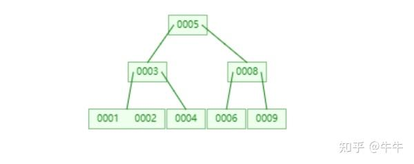
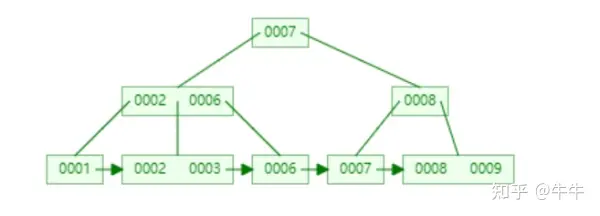

[参考](https://zhuanlan.zhihu.com/p/351240279)
# B- tree
## 基础概念
- 阶数：一个节点最多有多少孩子节点
- 关键字：节点上的数值就是关键字
- 度：一个节点拥有的子节点的数量

一个m阶的B- tree，有以下特征
- 根节点至少有两个子女
- 每个非根节点包含的关键字个数j满足：(m-1) / 2 ≤ j ≤ m-1
- 有k个关键字的非叶结点恰好有k+1个孩子
- 所有的叶子结点都位于同一层

# B+ tree
一个m阶的B- tree，有以下特征
- 每个节点至多有m个子女
- 每个非根节点包含的关键字个数j满足：(m-1) / 2 ≤ j ≤ m-1
- 相邻叶子节点通过指针连起来，并且通关关键字大小排序

## B- tree和B+ tree的主要区别
- B-树内部节点保存数据，但B+树内部节点是不保存数据的，只作索引作用。
- B+树的叶子结点通过链表指针连起来，而B-树不是。
- 查找时，B-树找到目的值就结束，而B+树要通过索引找到叶子结点才结束
- B-树任何一个关键字出现且只出现在一个结点中，而B+树可以出现多次

## B+树的插入
1. 先找到要插入的叶子结点
2. 如果被插入关键字的叶子节点当前含有的关键字数量小于阶数m，则直接插入。
3. 插入之后的关键字的数量如果等于m，则该节点分裂成两个新的节点，各包含一半的关键字。
4. 分裂后，将右边的关键字插入到父节点中，回到3
## B+树的查找
### 单值查找
在B+树中查找x
1. 在节点中找到第一个大于等于x的关键字，继续向下查找孩子节点
2. 直到在叶子节点中找到x
### 范围查找
在B+树中查找满足[l,r]的区间
1. 按单值查找找到l
2. 然后遍历链表
## B+树的删除
1. 找到包含关键值的节点，如果关键字个数大于(m-1)/2直接删除，如果删除的是父节点的关键字，则要更新父节点的值
2. 如果删除之后关键字个数小于(m-1)/2，则可以向兄弟结点借用关键字
3. 如果兄弟结点也不够，则要和兄弟结点合并，并且在父节点中删除右边孩子节点的关键字