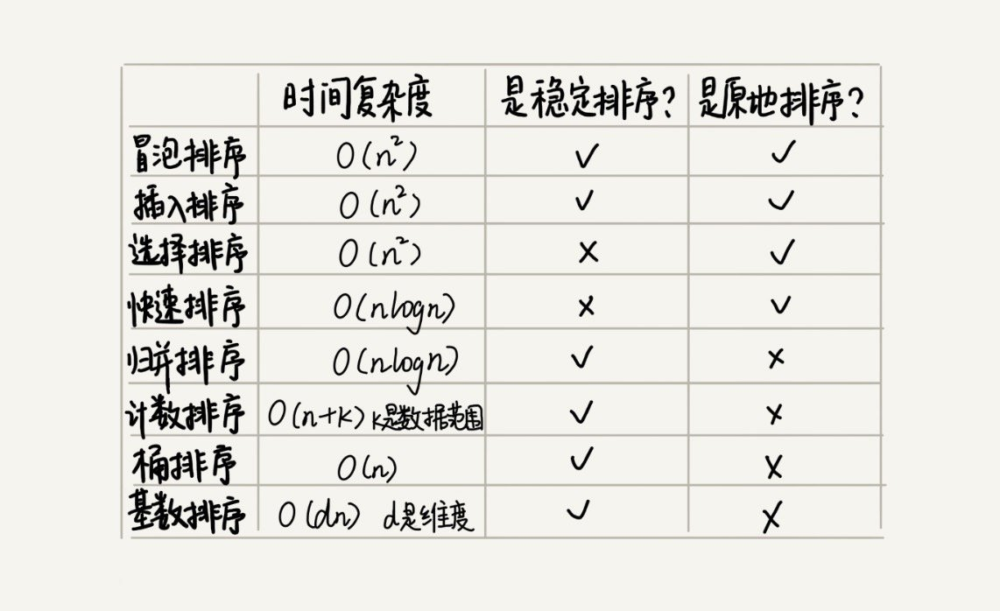

## 红黑树
### 特性
- 每个节点为红色或黑色。
- 根节点和叶子结点是黑色
- 红色节点不和红色节点直接相连
- 从根节点到任意叶子节点的路径，黑色节点的数量是相同的
### 插入和删除
- 插入红色节点，然后通过O(1)次旋转
- 删除最坏会有O(logn)次旋转
- 旋转是O(1)的
## 二叉树
### 二叉搜索树
- 使用有序的数生成的二叉搜索树会退化成链表
- 中序遍历是有序的
### 平衡二叉搜索树
- 每个节点的左子树和右子树的高度差不能超过1
- 会通过旋转维持平衡
### 堆
- 堆是完全二叉树
- 建堆操作从下往上对非叶子节点进行heapify操作
## 排序
