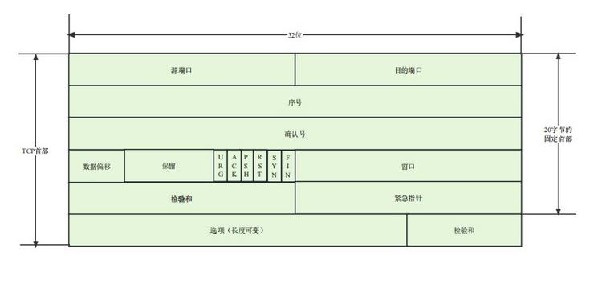
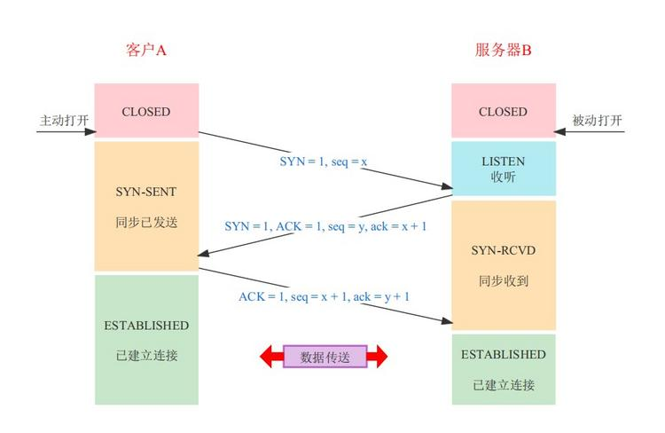
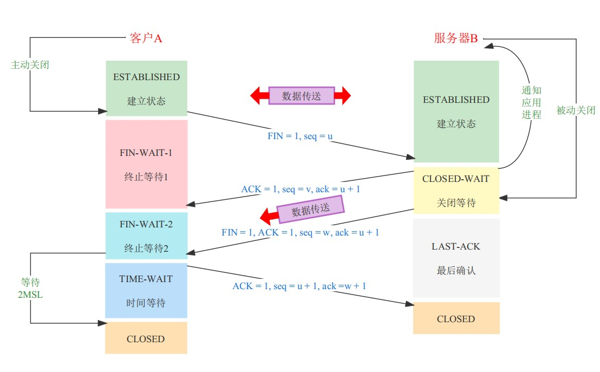

# 概述
## 为什么计算机网络要分层
- 简化网络设计
各层专注于完成特定的任务，可以是网络设计更简单。
- 模块化
每一层独立的设计和实现，比如网络层不需要考虑运输层的细节。
- 促进标准化
不同厂商只需要按照标准开发软件和硬件，便可以互相操作。
## 协议三要素
**语法、语义、时序**
## OSI七层网络模型
- 物理层：传输单位为**比特流**。常用设备有：集线器、中继器、网线、双绞线、同轴电缆。负责网络中数据的物理传输。
- 数据链路层：传输单位为**帧**，用MAC地址访问媒介，提供节点到节点的数据传输，负责检测和纠正物理层传输过程中出现的错误。
- 网络层：传输单位为**包**。通过IP寻址来建立两个节点之间的连接，选择合适的路由和交换节点传递给目的端的运输层。
- 传输层：传输单位为**段**。实现网络不同主机上的用户进程之间的通信，可靠传输、错误检测、流量控制、拥塞控制。
- 应用层：为应用程序提供网络服务，直接与用户交互。
## TCP
### 头部结构

### 校验和
TCP是端到端的传输，有发送方计算校验和，接收方进行验证，目的是为验证TCP首部和数据在发送过程中是否有差错。
### 序列号/确认应答
接收方接收到信息后回复确认应答号ACK，不仅会告诉接收到哪些数据，还包括下一次消息从哪里发送。发送方没有接收到ACK会重新发送数据。
### 超时重传
- 发送方发送时丢失，长时间没有接收到确认应答号，发送方会主动重新发送。
- 确认应答号ACK丢失，发送方也会重新发送，接收方通过校验和和序列号知道该数据已经接受，丢弃数据并发送ACK。
### 流量控制
在TCP报文字段中有个16位的字段标识滑动窗口的大小，窗口大小就是剩余缓冲区大小，在回复ACK时，接收方将自己剩余缓冲区大小填入。发送方会根据ACK里滑动窗口的大小调整自己的发送速度，如果缓冲区为0停止发送，并定期发送探测报文。
### 拥塞控制
慢启动、拥塞避免、快速重传、快速回复
### 三次握手
三次握手的目的

- **第一次握手**
客户端请求连接，将首部的SYN表示位置设为1，初始化序列号seq=x，发送给服务器，进入SYN_SENT状态
- **第二次握手**
服务器收到SYN后，将首部的SYN和ACK标识位置设为1，回复ACK的值为x+1，同时自己初始化一个序列号seq=y，发送给客户端，进入SYN_RECV状态。
- **第三次握手**
客户端接收到服务器的SYN和ACK包后，向服务器发送确认包ACK值为y+1，序列号seq=x+1，客户端进入established状态，服务器接收到此分组也进入established状态。
### 为什么不是两次握手
- 避免历史连接

如果一次客户端发送的连接请求在网络中滞留，又重新发送了连接请求然后连接成功，等关闭连接之后，滞留在网络中的连接请求到达服务端，服务端会就会发送确认认为已经建立了连接，浪费资源。如果是三次握手，则客户端收到服务器的确认不会进行下一次握手，服务器收不到第三次握手就不会开放连接。
- 同步双方初始序列号

第三次握手客户端可以确认服务端的序列起始号。（全双工）
### 四次挥手

- **第一次挥手**
客户端发送释放报文，并停止发送数据，将FIN置为1，序列号seq=u发送给服务器，u等于前面已经传送过来的数据的最后一个字节加1，进入FIN-WAIT-1状态。
- **第二次挥手**
服务端收到释放报文后，发送确认报文，ACK标识位置为1，ACK的值为客户端发送的序列号u+1，并带上自己的序列号v，然后服务端进入CLOSED-WAIT状态。这时服务端能继续发送数据，客户端也能继续接收数据。\
客户端收到服务端的确认后，等待服务端发送释放报文。
- **第三次挥手**
服务端数据处理完毕后，向客户端发送释放报文，FIN置为1，ACK的值u+1，因为可以会再发送一些数据，假设序列号为w，服务器进入LAST_ACK状态，等待客户端确认。
- **第四次挥手**
客户端收到释放报文后，会发送确认报文，ACK的值设为w+1，序列值seq=u+1，然后客户端进入TIME_WAIT状态，当客户端释放TCB时，才进入CLOSED状态。而服务端只要收到确认报文就会进入CLOSED状态。
### MSL
MSL是任何报文在网络中被丢弃前的最长存活时间，这个时间是有限的，因为TCP是以IP数据报的形式在网络中传输，IP有限制其生存的时间TTL，**RFC793指出MSL为2分钟，现实中常用30秒或1分钟**。
## TCP和UDP的区别
- **TCP面向连接**的，需要三次握手建立连接。**UDP不需要进行建立连接**。
- **TCP是可靠传输服务**。**UDP尽最大努力交付**，不保证可靠传输。
- TCP是**一对一连接**的。UPD支持**一对一、一对多、多对一**等多种方式的通信。
- TCP**适合需要可靠连接的服务**，比如付费、加密数据等等方向。**UDP传输效率高，实时性好**，应用于高速传输并且对实时性有要求的通信。
- TCP**首部较长**，且不固定长度。UDP首部**固定长度8字节**。
- TCP是流式传输，**保证顺序和可靠**。UDP是一个包一个包发送的，**可能会丢包和乱序到达**。
- TCP数据太大在**传输层**分片。UDP数据太大在**IP层**分片。
- TCP适用于**HTTP、FTP、电子邮件（SMTP、POP3）、SSH、MYSQL连接服务器**。UDP适用于**实时通信、视频流传输、在线游戏**等。
## IP
### 输入URL到显示屏连接的过程
- URL解析
- TCP连接
- 发送HTTP请求
- 页面渲染
- 断开连接
### Ping命令
- 客户端向目标主机发送一个ICMP回显请求数据报，包括发送时间和一个序列号。
- 目标主机收到ICMP回显应答数据报，也包括发送时间和一个序列号。
- 客户端可以根据回显应答数据包计算往返时间。
- ICMP只能检测连接，不能检测宽带。
### traceroot
traceroot是一种更高级的网络工具，用于追踪源主机到目标主机的传输路径。它通过逐步增加TLL的大小，来确定数据包经过的每一个路由器。\
因为路由器会给源主机发送ICMP"超时"消息。