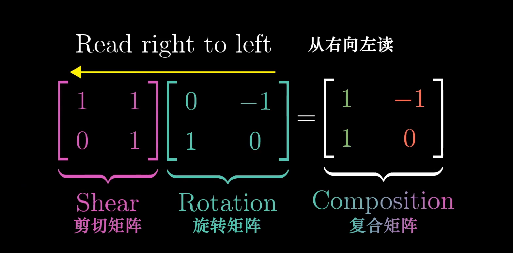
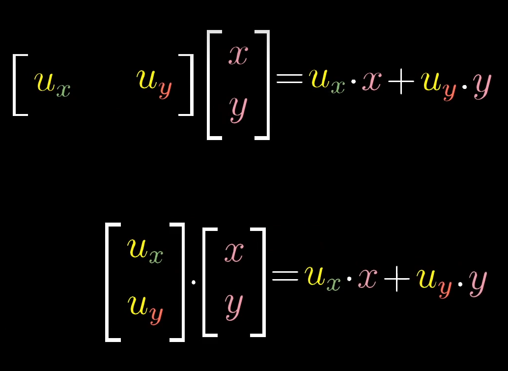
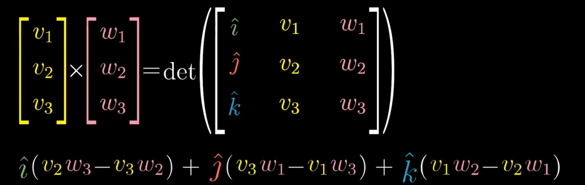
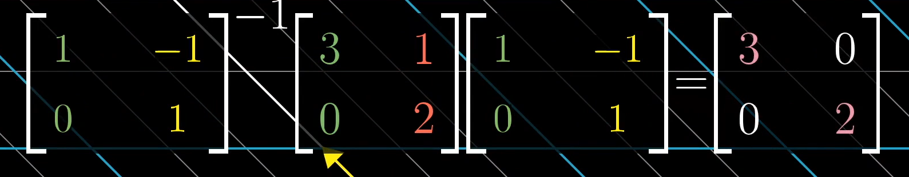
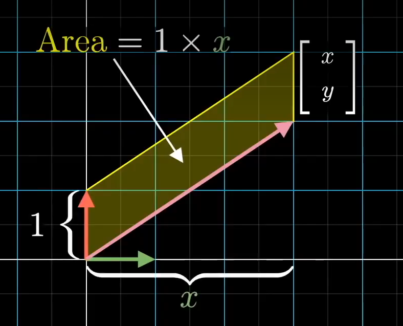
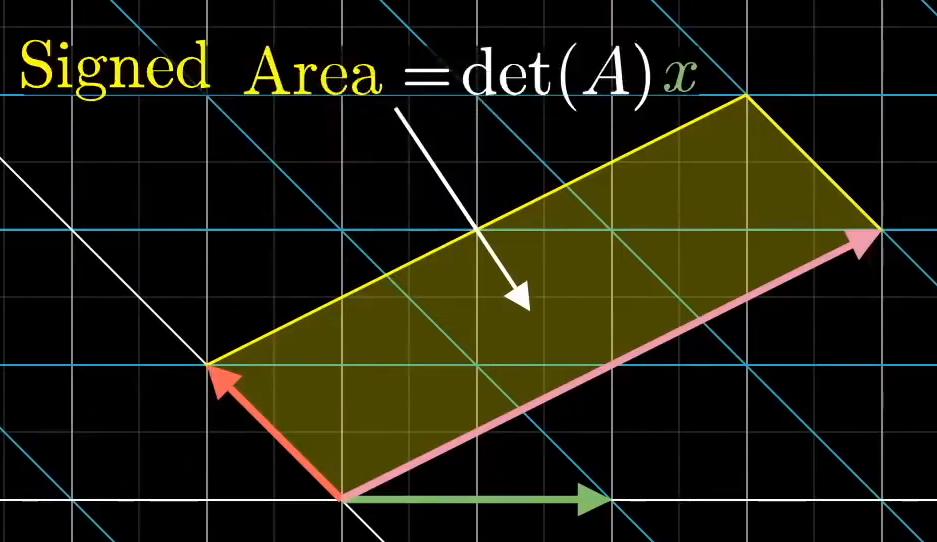
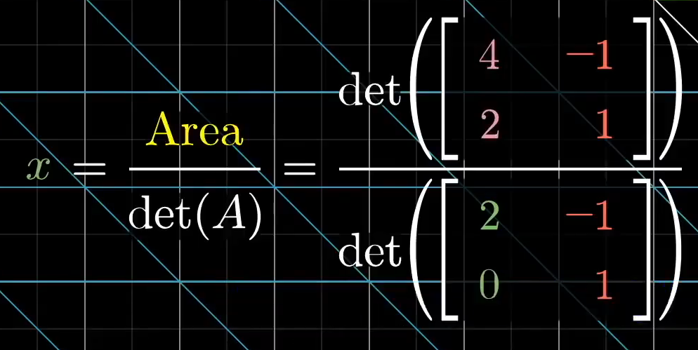

## 对向量的认识
对于学物理的同学来说，向量就是一个箭头。对于学计算机的同学来说，向量就是一组**有序**的数，比如stl的vector。我比较害怕数学家，就不讨论学数学的同学了。
## 在线性代数中的向量
向量有两个基本的运算贯穿线性代数始终，分别是**向量+向量**和**标量×向量** ，另外在线性代数里，几乎所有的向量都可以默认是从原点（0,0）起始的。
## 二维空间中向量的运算
向量+向量符合平行四边形法则，也就是把其中一个向量的起点移动到另一个向量的终点。如下图：\
\
标量×向量就是对向量的伸缩
## 线性相关性
考虑在二维空间中，如果一个向量可以由另外几个向量通过上面两个运算得到，则称他们是线性相关的。否则他们是线性无关的
## 张成的空间
给一个向量集，如$\vec{a},\vec{b}$,两个标量$x,y$可取任意值，$x\vec{a}+y\vec{b}$能表达的所有向量终点的集合就是这个向量集张成的空间
## 基
基的严格定义：**向量空间的一组基是张成该空间的一个线性无关向量集**\
特殊的，在二维空间中，两个不共线的向量就是一组基，他们能表示在这个二维平面中任意一个向量。
## 线性变换
线性变换可以看成对基向量的变换。\
线性变换可以看成**对空间的挤压伸展，保持网格线平行且等距相等。**\
比如逆时针旋九十度，我们可以追踪i帽和j帽的变化，用矩阵描述这个线性变换。（同维度的变换肯定是方阵）\
两个条件：一是原来的直线，在变换之后还是直线。二是原点必须固定。\
**严格定义：**\
Additivity:$L(\vec{v}+\vec{w})=L((\vec{v})+L({\vec{w}}))$\
Scaling:$L(c\vec{v})=cL(\vec{v})$
## 矩阵乘法
两次线性变换叠加，换成矩阵乘法，如下图所示。（先旋转再剪切，也就是旋转后的基向量，再根据剪切矩阵转换。）
显然变换的顺序不同，乘法的结果也不同。\

从线性变换的角度来看**矩阵乘法结合律**，(AB)C和A(BC)都是按CBA的顺序变换的，所以这两个式子相等。
## 行列式
一个2x2的矩阵的行列式在二维空间中可以看成单位正方形在变换后面积的变化。\
同理3x3的矩阵的行列式在三维空间中可以看成单位立方体在变换后面积的变化。如果面积变成了0，则这个**矩阵的列肯定是线性相关的**。\
对于两个变换M，N，det(MN)=det(M)*det(N)，在二维空间中直观上可以想象单位正方形面积的变化。
## 逆矩阵
$A\vec{x}=\vec{a}$。**几何意义**是找到一个向量 $\vec{x}$，经过A变换之后变成 $\vec{a}$。定义从 $\vec{a}$ 到 $\vec{x}$ 的变换为A的逆，记为 $A^{-1}$，有$AA^{-1}\vec{x}=I\vec{x}=A^{-1}\vec{a}$。
## 列空间、秩、零空间
对于一个nxn的方阵，每一列都对应一个基向量，这组基张成的空间就是列空间。秩等于列空间的维度。等于n的话就是满秩，也就是这些列向量线性无关。\
如果不是满秩，假设在二维空间中，变换之后空间变成了一条线，则在某一条直线上的向量，经过变换之后被压缩到了原点，这条线称为**零空间**。在三维空间中，如果变换之后空间变成了一条线，则零空间是一个平面。
## 点乘
在二维平面中，点乘可以看成降维的线性变换，平面变成一个数轴（这个数轴可以和其中任何一个向量共线），变换后在这个数轴上的值就是点乘的结果。
下面这个图中，**u是这个数轴的单位向量**。
\
这一集有点困难。看了不下五遍。
## 叉乘
大小是行列式的值，方向垂直于两个向量（使用右手判断方向）。\
\
后面在线性变换的角度，通过对偶性引入点乘，解释了这个式子，不过我只看了一遍，不是很懂。
## 基变换
选用不同的基向量，描述同一个向量的的结果不同。\
在二维空间中，我们比较容易接受的一组基向量是(1,0)和(0,1)，对于**不同的基向量**，我们可以理解为从原来的空间通过**线性变换**转换，矩阵记为A。对于我们熟知的线性变换，比如逆时针旋转九十度，矩阵记为M。\
一个向量 $\vec{v}$，转换到A变换的空间逆时针旋转九十度为 $A^{-1}MA\vec{v}$。
## 特征值、特征向量
一些向量在线性变换后，**只改变大小**，对于这种向量满足 $M\vec{v}=λ\vec{v}$，$λ$可以写成$λI$，整理一下$(M-λI)v=\vec{0}$，也就是让左边这个矩阵的**行列式等于0**，计算出特征值，代入原来的式子就能得到特征向量所在的空间了（二维空间中一般是直线方程）。\
利用只改变大小的性质，可以通过基变换，把基向量转换成能张成原来空间的若干个特征向量（这组基叫特征基），可以简化多次利用这种变换的计算。\
如下图，先转换基向量，再进行线性变换，在转换到原来的坐标系，只是伸缩了大小。\

## 抽象向量空间
满足八大定理，随意定义一些东西，就可以使用向量的所有性质和计算方法。
## 克莱姆法则
如下图，黄色区域的面积是x。\
\
该黄色区域的变化相当于把基向量为红色和粉色的线性变换。这个面积相当于单位正方形。\
