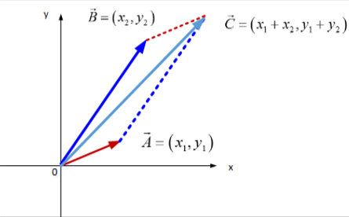

# 向量
## 对向量的认识
对于学物理的同学来说，向量就是一个箭头。对于学计算机的同学来说，向量就是一组**有序**的数，比如stl的vector。我比较害怕数学家，就不讨论学数学的同学了。
## 在线性代数中的向量
向量有两个基本的运算贯穿线性代数始终，分别是**向量+向量**和**标量×向量** ，另外在线性代数里，几乎所有的向量都可以默认是从原点（0,0）起始的。
## 二维空间中向量的运行
向量+向量符合平行四边形法则，也就是把其中一个向量的起点移动到另一个向量的终点。如下图：

基的严格定义：向量空间的一组基是张成该空间的一个线性无关向量集