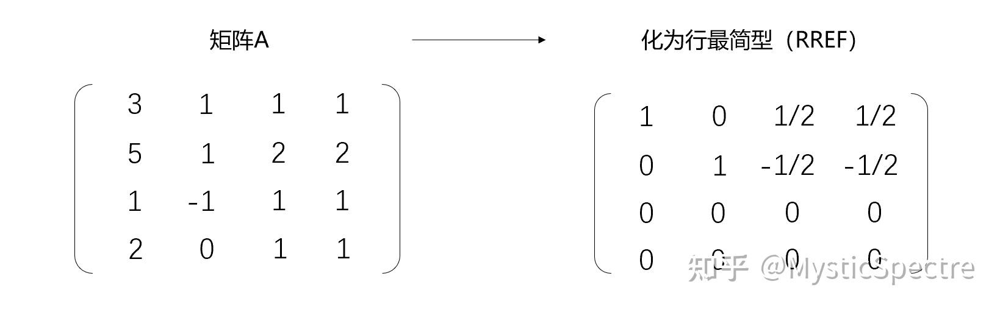
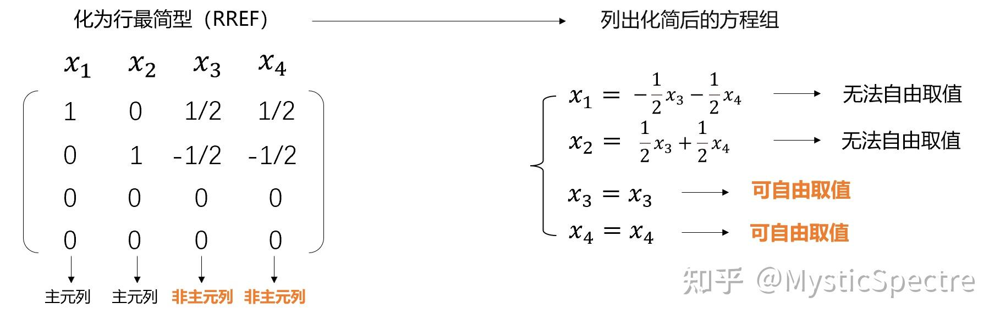
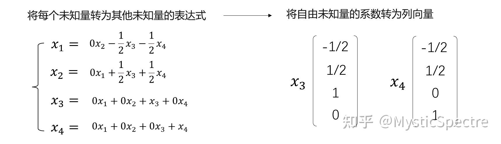

## 齐次线性方程组
不会出现增广矩阵秩大于原矩阵的情况，所以只有两种情况
- 唯一零解
- 无穷多解

矩阵满秩有唯一零解，下面讨论无穷多解的基础解系和通解
### 基础解系
1. 先将矩阵化为行最简矩阵

2. 列出化简后的方程组

如图，能自由取值的未知量有两个，例如$x_3$，我们可以将其他可自由取值的未知量设为0，不可自由取值的未知量用$x_3$表示便可得出基础解系的一个向量。**所以，$$基础解系中向量的个数=零空间的维数=n-r$$**
3. 转换为列向量，即为基础解系

设$\vec{α_1}=(-\frac{1}{2},\frac{1}{2},1,0)^T$
设$\vec{α_2}=(-\frac{1}{2},\frac{1}{2},0,1)^T$
该齐次线性方程组的通解可表示为$\vec{x}=k_1*\vec{α_1}+k_2*\vec{α_2}$
### 非齐次线性方程组：$Ax=b$增广矩阵： $\overline{A}=[A|b]$

解的情况会有三种
- 无解 $r(\overline{A})=r(A)+1$
- 唯一解 $r(A)=r(\overline{A})=n$
- 无穷多解 $r(\overline{A})=r(A)=r<n$

齐次线性方程组的通解为非齐通解+一个特解，可以用高斯消元计算，如果是唯一解还可以克莱姆法则计算